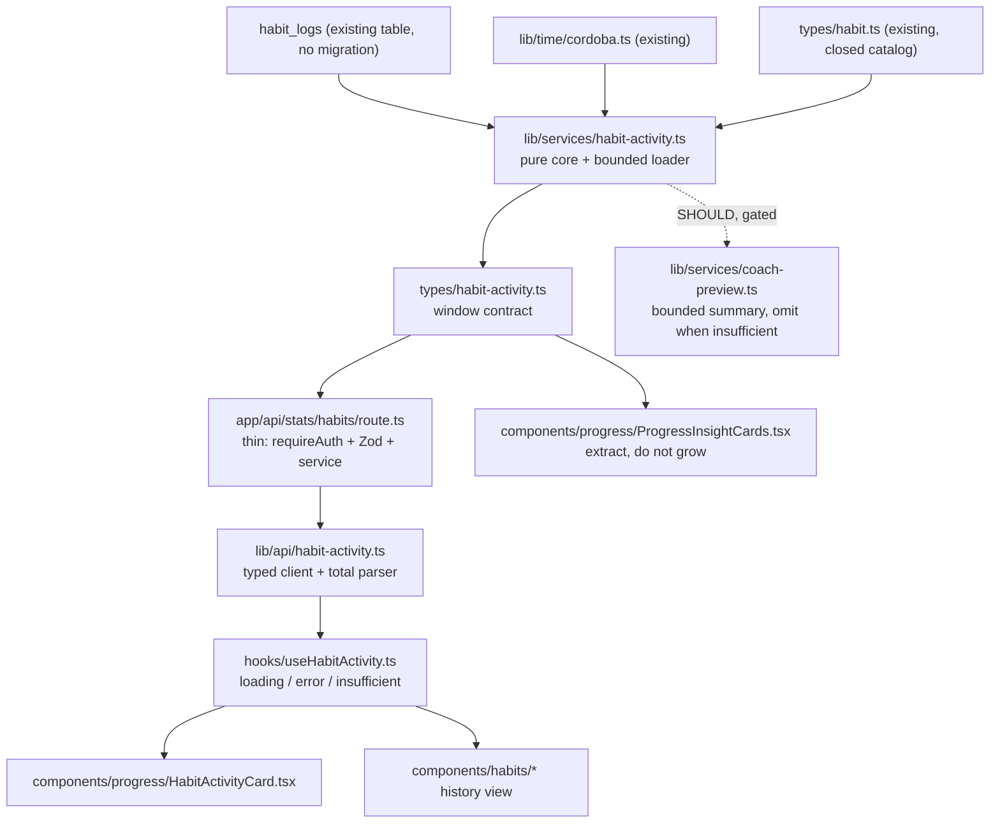
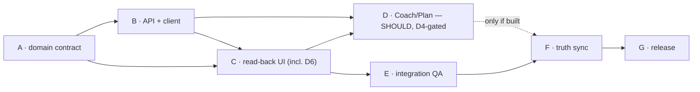

# Atlas Fitness v0.9.0 — Habits & Adherence — Product + Architecture Brief

**Status:** **APPROVED FOR IMPLEMENTATION** — product/architecture brief. Product decisions **D1–D6 are resolved and approved** (§15), and the approval-era independent review of this artifact **passed** (§19.8). Nothing is implemented: no product code, no schema change, no PR. The PR-level Architecture and PO gates of `AGENTS.md` §5 still apply before the first line of v0.9.0 code.
**Type:** Discovery + architecture brief only. No product code, no behavior change, no PR, in this deliverable.
**Scope:** Atlas Fitness v0.9.0 "Habits & Adherence".
**Baseline:** `develop` @ `933258252130e8a9f86f6fc8ce47353dc4f77532` (`Merge pull request #161 from EstebanIndiveri/chore/release-sync-v0.8.0`), `package.json` version `0.8.0`.
**Companion ADRs:** `docs/architecture/ADR-001-system-stack.md`, `ADR-001b-habit-motivation.md`, `ADR-002-client-channels.md`, `ADR-003-gemini-guided-session.md`, `ADR-004-sessions.md`, `ADR-005-ownership-catalog.md`.

---

## 1. Phase 0 — Preflight verification (verified, not asserted)

| Check | Command | Result |
|---|---|---|
| HEAD SHA | `git rev-parse HEAD` | `933258252130e8a9f86f6fc8ce47353dc4f77532` |
| Baseline | `git rev-parse origin/develop` | identical SHA; HEAD is an ancestor of `origin/develop` |
| Worktree cleanliness | `git status --porcelain` | empty |
| Open PRs | `gh pr list --state open` | `[]` |
| Version | `package.json` | `0.8.0` |

**Gate result: PASS.** Discovery ran against a verified, clean, current baseline. `v0.8.0` is treated as closed and is not reopened or redesigned by this brief.

---

## 2. Phase 1 — Discovery method and evidence surface

Targeted reads only (no directory-wide dumps), plus two independent LOW-reasoning explore workers on two genuinely disjoint factual questions (Progress/adherence facts; Profile/Coach context facts). Workers were released after their output was incorporated; their findings are cited inline and were cross-checked by the parent against the cited files.

Surfaces read: `types/*`, `lib/db/schema.ts`, `lib/services/{habit-logs,streaks,weekly-consistency,progress-summary,strength-progress,daily-checkin,coach-preview,coach-recommendation,guided-training-plan-input}.ts`, `lib/ai/weekly-plan-prompt.ts`, `lib/api/habits.ts`, `lib/time/cordoba.ts`, `app/api/{habits,checkin,workouts,stats/week,stats/streak,cron/*}/route.ts`, `components/{habits,today,progress,profile,shell}/*`, `hooks/useHabits.ts`, `lib/copy/{progress,today,ui}.ts`, `e2e/*`, `jest.config.ts`, `CHANGELOG.md`, `docs/architecture/ADR-001b-habit-motivation.md`, `docs/backlog/README.md`, `docs/superpowers/specs/2026-09-26-weekly-plan-strategy-composer-design.md`.

**Dominant constraint discovered:** the **DATA HONESTY RULE** is not a stylistic preference in this repo — it is a typed, tested doctrine. `types/metric.ts` defines `MetricSource = 'user_input' | 'atlas_computed' | 'external_integration' | 'ai_recommendation'` and `Metric<T>` cannot be rendered without declared provenance; `lib/services/habit-logs.ts`, `lib/db/schema.ts` (habit table comment), `types/week.ts`, and existing habit tests ("never fabricates habit target values or progress percentages", "keeps steps and sleep as honest toggle rows instead of fabricating values") all enforce it. Every v0.9.0 decision below is constrained by it.

---

## 3. Phase 2 — Current-state truth matrix

Classification vocabulary: **EXISTS+PRODUCTION-BACKED** (written, read, rendered, tested) · **EXISTS+PARTIAL** (works but a narrow or weaker form) · **UI ONLY** (rendered without a backing contract) · **DATA EXISTS BUT UNUSED** (persisted, no *historical* read path — a today-only read does not make it used) · **NOT IMPLEMENTED** · **INTENTIONALLY DEFERRED** (deliberate prior decision) · **UNKNOWN**.
Evidence labels: **FACT** (verified in the cited path) · **INFERENCE** (derived from verified facts) · **OPPORTUNITY** (product judgment).

**Naming note for this matrix (read with §5.4).** Rows 7, 8, 17, 23 and 24 describe the absence of any *habit contribution to a metric*, and rows 21/22/39 the training metric that does exist. Two facts bound this matrix: the string "adherent" appears **nowhere** in the codebase (`git grep -i "adheren"` → 0 hits outside this document), and the existing training metric is named **consistency** (`types/week.ts`, observational: an ended workout or a check-in). So where the matrix below says "adherence" it means either that training-consistency metric or the **unmodeled target concept** the domain cannot compute. The capability v0.9.0 actually delivers is **observed habit activity** — a count of recorded days — and no row below is evidence for, or a claim about, adherence to a target.

| # | Capability | Class | Evidence | Label |
|---|---|---|---|---|
| 1 | Habit catalog definition (create habits) | NOT IMPLEMENTED | `types/habit.ts` exposes a closed constant `HABIT_KEYS = ['hydration','walk','mobility','sleep']`; no table, no create path | FACT |
| 2 | Habit catalog read | EXISTS+PRODUCTION-BACKED (static) | `types/habit.ts`, `components/habits/habit-catalog.ts` (`HABIT_PREVIEWS`, `countCompletedHabits`) | FACT |
| 3 | Habit completion for today | EXISTS+PRODUCTION-BACKED | `POST /api/habits` → `setHabitLog` (Zod-validated upsert) → `habit_logs`; UI `hooks/useHabits.ts` optimistic toggle with rollback | FACT |
| 4 | Quantitative habit amount | EXISTS+PARTIAL | `QUANTITATIVE_HABIT_KEYS = ['hydration']`; step 0.25 L, max 20 L; `habit_logs.amount` text; cleared when `done=false` | FACT |
| 5 | Habit history persisted | DATA EXISTS BUT UNUSED | `habit_logs` rows accumulate per `(user_id, local_date, habit_key)` with index `habit_logs_user_id_local_date_idx`; **no range query, no historical endpoint, and no UI reads them back as history** — today's state is read (see #6), the accumulated history is not | FACT |
| 6 | Habit **historical/windowed** read path | NOT IMPLEMENTED | The *today* read path **does exist** (`getHabitLogsForDate(userId, localDate)`, `getTodayHabitLogs`, `GET /api/habits`, `hooks/useHabits.ts` consumed by `components/habits/HabitsScreen.tsx` and `components/today/TodayHabitsCard.tsx`). What does not exist is any call that reads a **non-today** date or a **range**: no windowed loader, no aggregation, no historical endpoint | FACT |
| 7 | Habit activity / consistency metric over recorded days | NOT IMPLEMENTED | No `adherence` symbol exists anywhere in the codebase; no habit input to any metric | FACT |
| 8 | Habit activity UI | UI ONLY (declares its own absence) | `components/progress/ProgressInsightCards.tsx` `HabitConsistencyCard` renders only **today's** `doneByKey` plus `PROGRESS_COPY.habits.todayOnly` = "Hoy registraste N de 4 hábitos; eso no se muestra como porcentaje histórico." + empty body "Todavía no hay historial suficiente para calcular consistencia por hábito." | FACT |
| 9 | Habit editing (rename/retarget/reorder/unit) | NOT IMPLEMENTED | no such path anywhere | FACT |
| 10 | Habit archive/delete | NOT IMPLEMENTED | `habit_logs` has no `deletedAt`; no destructive habit operation exists | FACT |
| 11 | Habit schedule / frequency / targets | INTENTIONALLY DEFERRED | `habit_logs` column comment: "no targets, ratios, or progress percentages are fabricated (DATA HONESTY RULE)"; today copy: "No hay metas ni métricas automáticas." | FACT |
| 12 | Habit reminders | NOT IMPLEMENTED | Only outbound reminder is `streak_nudges` (`rule = active_yesterday_not_today`) via Telegram; the sole notification affordance is inert copy `notificationsSoon = 'Notificaciones — próximamente'` (`lib/copy/ui.ts:36`, surfaced at `components/shell/AppHeader.tsx:40`) — no scheduling surface, no per-user opt-in | FACT |
| 13 | Training completion | EXISTS+PRODUCTION-BACKED | `workouts.endedAt` + unique active workout index in `lib/db/schema.ts` | FACT |
| 14 | Session history | EXISTS+PRODUCTION-BACKED | `getProgressSummary(userId, period)` → `sessions[]` with routine name, date, duration | FACT |
| 15 | Weekly consistency (training) | EXISTS+PRODUCTION-BACKED | `computeWeekConsistency(today, activeDates)` + `GET /api/stats/week`; Monday-first; every value `atlas_computed` | FACT |
| 16 | Streak | EXISTS+PRODUCTION-BACKED | `lib/services/streaks.ts`; active-day rule = ended non-deleted workout **OR** `daily_checkins` row for that Córdoba date | FACT |
| 17 | Habit rows feeding any derived metric (incl. the training active-day rule) | NOT IMPLEMENTED | the active-day rule in (16) has no habit term | FACT |
| 18 | Wellness check-in (mood/energy/note) | EXISTS+PRODUCTION-BACKED | `daily_checkins` unique `(user_id, local_date)`; `POST /api/checkin`; `energy` CHECK `low|medium|high`, nullable for legacy mood-only rows | FACT |
| 19 | Prompt "Mood & energy" block | EXISTS+PRODUCTION-BACKED | Today screen composes `MoodEnergyCheckIn` | FACT |
| 20 | Routine completion / logged sets | EXISTS+PRODUCTION-BACKED | `workouts`, `workout_sets`; volume computed in `strength-progress.ts` | FACT |
| 21 | Training-consistency contract documented | EXISTS+PRODUCTION-BACKED | `types/week.ts` doc-comment defines the active-day rule and provenance | FACT |
| 22 | Training consistency exposed via API | EXISTS+PRODUCTION-BACKED | `GET /api/stats/week`, `GET /api/stats/streak` | FACT |
| 23 | Habit rows → derived metric | NOT IMPLEMENTED | none | FACT |
| 24 | Coach ← training metric / habit consumption | NOT IMPLEMENTED | grep for habit/adherence symbols across `lib/services/coach-*`, `lib/services/guided-training-plan*`, `lib/ai/*` returns no matches; adapters read routine, `energy`, `mood`, optional `freeText` only | FACT |
| 25 | Coach adaptation preview | EXISTS+PRODUCTION-BACKED (read-only) | `lib/services/coach-preview.ts`; mood/energy fall back to today's check-in | FACT |
| 26 | Coach mutation authority | EXISTS+PRODUCTION-BACKED (gated) | the ONLY state-changing path is a user-initiated adapted workout start with `adaptation.result` + optional `dailyCheckInId`/`checkInContext` in `app/api/workouts/route.ts`; recommendations persisted with `decision ∈ {pending,accepted,rejected}` and `contextSnapshotJson = {mood, energy, freeText?}` | FACT |
| 27 | Manual plan editor | EXISTS+PRODUCTION-BACKED | `app/dashboard/plan/[id]/edit` + `GET/PATCH /api/training-plan/[id]` | FACT |
| 28 | Guided plan generation | EXISTS+PRODUCTION-BACKED | `app/api/training-plan/generate`; brief fields taken from the **request body**; composite input `guidedTrainingPlanSchema` with `mutationId` + SHA-256 payload hash for idempotent save | FACT |
| 29 | Weekly plan Gemini prompt | EXISTS+PRODUCTION-BACKED | `lib/ai/weekly-plan-prompt.ts` inputs: goal, days, experience, equipment, session length, focus areas, exercise catalog, optional current plan; prompt forbids inventing ids/biometrics/guarantees | FACT |
| 30 | Plan ↔ adherence input | NOT IMPLEMENTED | the generation route reads nothing from server-stored activity; **improve-plan hardcodes `experience: 'intermediate'`, `sessionLengthMinutes: 55`** | FACT |
| 31 | Profile / "Mi Atlas" persisted preferences | EXISTS+PARTIAL (under-consumed) | `user_preferences` (goal/pace/equipment, CHECK-constrained, nullable); written by onboarding finish + `PUT /api/profile/preferences`; readable via `GET`; **only consumer is client-side prefill (`useGuidedPlan`) and the preferences API itself** | FACT |
| 32 | Preference → plan influence | EXISTS+PARTIAL | purely indirect via client-side form defaults; server-side generation ignores stored preferences | FACT |
| 33 | Cross-device persistence | EXISTS+PRODUCTION-BACKED (server) / PARTIAL (client) | Turso/libSQL + Drizzle, ownership by `userId`; but `useHabits` loads and holds **today only**, so continuity is invisible across devices even though rows persist | FACT |
| 34 | Cross-user ownership / isolation | EXISTS+PRODUCTION-BACKED | `userId` FK + `requireAuth` on `app/api/habits/route.ts` and every stats route; unique indexes scoped per user; `userId` never accepted from the client | FACT |
| 35 | Explicit confirmation before mutation | EXISTS+PRODUCTION-BACKED (plans/coach) / N-A (habits) | plan replacement requires comparison + explicit confirm; coach requires user-initiated start. Habit toggles are immediate and non-destructive | FACT |
| 36 | AI habit recommendations | NOT IMPLEMENTED | no AI surface for habits; every AI prompt in the repo forbids invention | FACT |
| 37 | Habit entry point | EXISTS+PARTIAL | `/dashboard/habits` is reachable only from Ajustes → row `habits-settings`. Bottom nav (`components/shell/nav-links.ts` `APP_NAV_LINKS`) is Today / Entrenamiento / Progreso / Perfil only | FACT |
| 38 | Habit coverage in automated tests | EXISTS+PRODUCTION-BACKED (today only) | 41 habit-related Jest tests across `lib/services/habit-logs.test.ts`, `app/api/habits/route.test.ts`, `hooks/useHabits.test.ts`, `components/today/TodayHabitsCard.test.tsx`, `app/dashboard/habits/page.test.tsx`; `e2e/ux-habito.spec.ts` asserts exactly 4 rows and "0 de 4 completados" | FACT |
| 39 | Training-consistency coverage in automated tests | EXISTS+PRODUCTION-BACKED | `e2e/streaks.spec.ts` (incl. TZ double-count + cron idempotency), `e2e/cron.spec.ts` | FACT |
| 40 | Observability for stats reads | UNKNOWN | no evidence of per-endpoint metrics/tracing for `/api/stats/*` was found; not disproven | UNKNOWN |

### 3.1 Truth-honesty defects found in the existing UI (not caused by v0.9.0; must not be silently worsened)

| Defect | Evidence | Label |
|---|---|---|
| Card titled "Hábitos consistentes" computes **no historical consistency** | `ProgressInsightCards.tsx` / `lib/copy/progress.ts` | FACT |
| "Bienestar registrado" card renders today-only check-in data while sitting under the month/quarter period tabs | `ProgressInsightCards.tsx` + `lib/api/checkin.ts` (today only) | FACT |
| "Compartir progreso" and "Notificaciones" header buttons render with **no handlers** | `components/progress/ProgressHeader.tsx` | FACT |
| Recent-session rows always print "Volumen no disponible" although volume is computed for the same sessions | `RecentSessionsCard.tsx` vs `lib/services/strength-progress.ts` | FACT |
| Implied capability: "Hábitos de bienestar" row description "Ver actividad y hábitos" promises **historical** activity that has no read path (the screen shows today only) | `app/dashboard/settings/page.tsx` | FACT |

These five are recorded as **pre-existing** honesty defects. v0.9.0 MUST fix the two that are directly in its path — **#1 and #2** — and MUST NOT introduce new ones. **#2 is classified as MUST for a specific reason (D6): it is a *truthfulness* defect, not a missing enhancement.** Verified in `app/dashboard/progress/page.tsx`: `<PeriodTabs period={period} onChange={handlePeriodChange} />` renders **unconditionally at line 105**, above the data block, while `<WellbeingCard …/>` renders **inside** the conditional block at **line 120** (`{!loading && !error && summary ? ( … ) : null}`, lines 109–132). The card takes only `{ checkin, loading, error }` (`components/progress/ProgressInsightCards.tsx`, where `WellbeingCard` is declared), and there is **no `period` prop** anywhere in that file; its own empty copy says "Todavía no registraste ánimo o energía **hoy**" (`lib/copy/progress.ts`). A user who selects "3 meses" therefore moves the period control and the period-scoped cards while the wellbeing card continues to show **today-only** data under that period context. v0.9.0 corrects the **labeling/structure** so the card cannot be read as period-scoped. It **MUST NOT** fabricate historical wellness data to make the longer-period tab true — the honest fix is a truthful label, not invented history. #3–#5 are logged as candidates, not silently absorbed into scope.

### 3.2 Structural summary of the truth matrix

- The **write** side of habits is complete and tested, and so is the **today-only read** side. What does not exist is the **historical/windowed read** side: habits are readable *only* as the current day's state.
- **One training metric exists but has exactly one definition** (ended workout OR check-in), and habits are not part of it — correctly so, since the metric is observational and habits carry no stored expectation (§5.4). `habit_logs` is the only user-entered daily-positive behavior that is invisible to every derived metric.
- **The schema already supports the entire MUST scope of v0.9.0 without a migration.** `habit_logs` has `localDate` plus the `(user_id, local_date)` index. A windowed read is a pure additive query.
- **The product already advertises the missing capability** ("Hábitos consistentes", "Ver actividad y hábitos") while the domain refuses it. Closing that gap is the highest-value, lowest-risk move available.
- **Nothing in Coach or Plan consumes stored activity data**, and improve-plan hardcodes experience and session length. This is the largest latent product gap found, and it is *blocked on* the habit **historical** read path, not on new AI work.

---

## 4. Phase 3 — Problem statement

**Root problem: Atlas lets a user record habits but can only recall them for *today*, so the record they volunteered is never turned back into historical information — and the only metric that does exist ignores it.**

Four consequences, each traceable to the matrix above:

1. **Habits are readable only as today, never as history.** A habit row persists in `habit_logs`, but the only read path resolves **the current local date**: `getTodayHabitLogs` (via `GET /api/habits`) and `getHabitLogsForDate`, which is date-parameterized yet never called with a non-today date in production. At Córdoba midnight a user's entire habit history becomes unreachable through every surface Atlas has. The user's only feedback is a checkbox that resets. There is no continuity, no "I have been doing this", and no record they can inspect. (Matrix #5, #6)
2. **The existing training metric is blind to the behavior users actually enter daily.** Its active-day rule counts workouts and check-ins. A user who logs mobility, a walk, and hydration every single day but trains twice a week is counted as inactive — a statement that is not merely unhelpful but *false* about their recorded behavior, and one that no habit metric currently offsets. (Matrix #13, #17)
3. **The product promises a capability the domain refuses.** Progress renders "Hábitos consistentes" and then explains it cannot compute habit consistency; Ajustes describes the habits row as "Ver actividad y hábitos" pointing at a screen that shows only today's checkboxes — no historical activity and no history. (Matrix #8; defects #1, #5)
4. **The richest behavioral signal the user volunteered is stranded.** Coach and Plan generate recommendations from routine shape, mood, energy and free text, while the record of what the user actually does every day — written daily, readable only for today — goes unread by every historical consumer in the same database. (Matrix #24, #30)

**What the problem is NOT.** It is not a motivation deficit requiring rewards, and it is not a data-capture deficit requiring wearables or sensors. The data is already being captured, by hand, honestly, every day. The defect is **entirely on the historical-read and interpretation side**: Atlas cannot *historically* compute anything from rows it already owns — it can only show them back for the current day.

**Why now.** v0.8.0 closed plan/routine lifecycle and plan generation. The habit write path, the Córdoba time helpers, the `Metric<T>` provenance system, the `/api/stats/*` family and the streak/consistency services are all in place and tested. The read-back is now a small additive change rather than a new subsystem — which is exactly why it should be done *before* any new habit surface (creation, schedules, reminders) is layered on top.

---

## 5. Phase 4 — Product thesis (validation or challenge)

### 5.1 Framing verdict: **VALIDATE, with a sharpened definition**

"Habits & Adherence" is the correct wave. But as written it is ambiguous in a way that would let the execution drift into exactly what ADR-001b and the DATA HONESTY RULE forbid. The brief therefore fixes the definitions before any design:

> **Product thesis (v0.9.0) — approved.** *Atlas v0.9.0 converts existing habit records into honest, historical and reusable information, connecting Habits and Progress without inventing goals, targets or scores the domain does not yet model. Coach consumption is an optional extension after the read path is proven.*

**Read the thesis precisely — what "the read path" means here (factual correction).** The thesis is quoted verbatim as approved; the phrase *"the read path"* means **the historical / windowed read path**, and that qualification is load-bearing. Atlas **already has** a today-only habit read path in production: `getHabitLogsForDate(userId, localDate)` and `getTodayHabitLogs` in `lib/services/habit-logs.ts`, exposed by `GET /api/habits` (`app/api/habits/route.ts`), called by `fetchTodayHabitLogs` (`lib/api/habits.ts`) and consumed by `hooks/useHabits.ts` through `components/habits/HabitsScreen.tsx` and `components/today/TodayHabitsCard.tsx`. Habits are therefore **not** write-only, and no part of v0.9.0 rests on the claim that they are. The defect this release closes is narrower and must be stated narrowly: **there is no historical/windowed read path.** `getHabitLogsForDate` is date-parameterized but no production caller ever passes a non-today date; nothing loads a *range*; nothing aggregates across days; and no endpoint or UI reads `habit_logs` back as history. Coach is an optional extension *after that* historical path is proven — not after inventing a today read, which already ships.

The earlier draft of this thesis said Atlas should turn habits into "a persisted, user-owned behavior log with an honest read-back." That was directionally right but left one word free to do damage: it did not say **what** the read-back is. This revision states it, because the release name is "Habits & Adherence" and "adherence" is the precise term for the thing the domain **cannot** yet compute. See §5.4 for the normative vocabulary.

Four commitments the thesis implies:

1. **Historical read path before new surface.** Ship the ability to read `habit_logs` **history** before adding habit creation, schedules, targets or reminders. Adding surface to a log that can only be read as "today" reproduces the same dead end at greater cost.
2. **Observed habit activity must be a countable fact, never a judged performance.** The only denominator v0.9.0 owns is the **calendar**: days elapsed in the window. Counting "days on which you recorded at least one habit" over "days elapsed" is honest because both terms are stored facts. Counting anything over "your goal" is fabricated *in this release*, because the domain does not model a goal per date. (See §5.4 for the vocabulary, §9 for the exact rule, and §15 decision D2.)
3. **No targets unless the user declares them.** "3 de 4" is legitimate only as a *today* statement over a fixed catalog (as it exists today); it becomes dishonest the moment it is projected into a historical percentage. Any historical target requires an explicit, stored, user-declared frequency — which is **out of scope for v0.9.0** and approved as such (D1).
4. **Coach reads, never invents.** If habit activity reaches a prompt, it arrives as a bounded typed summary with explicit insufficient-data behaviour, is omitted rather than zero-filled when unreliable, is never framed as a judgment about the user, and never grants the Coach mutation authority over habits. Coach consumption is **SHOULD** and may begin only after the read path is implemented and verified (D4).

### 5.2 Alternative framings considered and rejected for v0.9.0

| Alternative framing | Why rejected |
|---|---|
| **"Habit Builder"** — habit creation, editing, cadence, per-habit goals, reminders | Inverts the thesis: builds writes on top of a log nobody can read, and pulls in a notification system (explicitly out). Also forces the 4-item catalog and `e2e/ux-habito.spec.ts` to change. Recommended as a **v0.10.0 candidate**. Note that the version label is a *candidate*, not a commitment: decision **D1 is settled NO for v0.9.0** (§15), so this out-of-scope item is deferred rather than pending a decision. |
| **"Habit Streaks"** — extend the streak rule to include habits | Cheapest perceived win, but it redefines an existing, tested, user-visible metric. A user's current streak would silently change meaning, and the change is irreversible once Telegram nudges reference it. Recorded as a deliberate **DEFER** with rationale. |
| **"Motivation & Rewards"** (Liftoff-adjacent) | Explicitly excluded by the wave brief. Also structurally dishonest in this product: a reward requires a target, and targets are forbidden by the honesty doctrine. |
| **"Adherence Score"** — one blended training + habit number | Fabricates a composite that no stored data supports and that no user asked for. Rejected; §9 forbids composites explicitly. |

### 5.3 The one thing this brief challenges in the original framing

The phrase "Habits & Adherence" implies the wave's job is to *build adherence*. It is not. An observational activity metric already exists and is production-backed for training (`GET /api/stats/week`, `GET /api/stats/streak`) — and, as §5.4 records, it is named **consistency**: it counts active days and stores no target. The wave's job is to give habits **the same observational shape in their own metric** — a recorded-day count — not to upgrade either metric into a target-based score, and not to merge habits into the training rule. Scoping this as "build habit adherence" would produce a second, parallel *target* system (goals, schedules, percentages), none of which the domain models; merging habit days into `streaks.ts` is a separate and explicitly deferred question (§17). Duplicating the training rule in a second module, or blending the two into one composite, is the exact duplication AGENTS.md §10/§11 forbids.

**Product decision D1 is approved (NO)** and recorded in §15. Execution is unblocked by product approval; it still requires Architecture sign-off per §19.4.

### 5.4 Normative vocabulary: observed habit activity ≠ true target adherence

The release is named "Habits & Adherence", so the two words must be fixed before any design. **They are not synonyms, and v0.9.0 ships only the first.** This subsection is the single authority for the terms; every other section uses them in exactly this sense.

| Term | Definition | Does v0.9.0 compute it? |
|---|---|---|
| **Observed habit activity** | A count of Córdoba calendar days on which the user's own stored rows record at least one habit (`done=true`), over the calendar days elapsed in a window. Both terms are stored or calendrical facts. No expectation is modelled or implied. | **Yes** — this is the entire v0.9.0 metric surface |
| **True target adherence** | Compliance against an explicit expectation: *which* habits were *expected* on *which* dates. Requires a stored schedule/target per habit per date. | **No** — deferred until Atlas models schedules/targets (§11.2) |

**Why the distinction is not pedantic.** The domain currently cannot answer "was this habit expected today?" There is no cadence, no frequency, no per-habit target, and no per-date expectation anywhere in the schema or the catalog. Presenting a day count as "adherence" would therefore assert a comparison the database cannot make: it would silently supply an implicit target of *every day, every habit*, which no user agreed to. That is precisely the fabrication the DATA HONESTY RULE forbids.

**Consequences, normative:**

1. **The activity metric MUST NOT be labeled or titled "adherencia".** Acceptable titles describe recorded days ("Días con registro", "Actividad en el período"). Forbidden: "Adherencia", "Cumplimiento", "Consistencia" as a quality claim.
2. **Forbidden presentations** (all imply an unmodeled target): "71% de adherencia", "71% de cumplimiento de la meta", any percentage against a schedule, any "cumpliste/no cumpliste" framing.
3. **Permitted presentations** (observational count/window only): "5 de 7 días con hábitos registrados", "Actividad en 5 de los últimos 7 días", per-habit "registrado en N días del período".
4. **v0.9.0 introduces no adherence vocabulary at all.** Verified: `git grep -i "adheren"` returns **zero** hits outside this document — so there is no existing "adherence" symbol, label or copy string to preserve or rename. The repo's existing training metric is named **consistency**, not adherence (`types/week.ts`: "authenticated weekly consistency snapshot", `WeekConsistency`, `WeekDayConsistency`; the Progress UI renders `consistencyPercent`). That metric is itself observational — an ended workout or a check-in, with no stored target — so it is not a counter-example but the same shape: **Atlas counts; it does not judge.** Because nothing is named "adherence", v0.9.0 has nothing to rename and adopts the word for nothing; it is reserved in this brief for the future, target-based concept only. **Net effect: no metric shipped by v0.9.0 makes a target-adherence claim at all** — and, as verified, neither does any metric already shipped.
5. **If a future wave models schedules/targets**, true target adherence becomes computable as a *new, separately-labeled* metric. It must never be produced by relabeling this activity count.

This vocabulary is directly testable and is encoded in §13 and §19.1 (honesty-negative rows).

---

## 6. Phase 5 — Contract: UX and state model

### 6.1 States (every surface, mandatory per AGENTS.md §10)

| State | Trigger | Required rendering |
|---|---|---|
| `loading` | request in flight | skeleton; **no zeroes, no empty defaults presented as data** |
| `today_recorded` | ≥1 habit row today with `done=true` | real toggles + real count |
| `today_unrecorded` | no `habit_logs` row for today | honest "unrecorded today" state (existing copy pattern) |
| `unavailable` | load failed / 401 | explicit unavailable state + session-expired copy; never empty defaults |
| `insufficient_history` | window has `< INSIGHT_MINIMUM_ELAPSED_DAYS` elapsed days, **or** `activeDays === 0` | explicit insufficient-data state naming *why* |
| `available` | ≥ `INSIGHT_MINIMUM_ELAPSED_DAYS` elapsed days and `activeDays ≥ 1` | the honest activity rendering (§6.3) |

**Why `activeDays === 0` and not "no rows in the window".** The `habit_logs` upsert persists a row for every habit the user touches, including `done: false` (`setHabitLog` writes `values({ …, done })` and `set({ done, … })`). A window can therefore contain many rows and **zero recorded activity**. A row-existence test would classify that user as "we have data" and then render a meaningless `0` as if it were a measurement. `activeDays` — days with ≥1 `done = true` row (§9) — is the only correct emptiness test for the historical metric, and because a habit day *is* activity (there is no "missed a day" state to distinguish from "not recorded"), `activeDays === 0` means exactly "no habit activity recorded in this window".

`today_unrecorded` and `insufficient_history` must be **distinguishable**. Conflating "you haven't logged today" with "we don't have enough history" is the exact ambiguity the current `HabitConsistencyCard` copy works around with a single vague sentence.

### 6.2 Surface-by-surface contract

**A. Hoy — `TodayHabitsCard` (contract preserved)**
Today-only remains today-only. The card keeps its real `N de 4` count over the fixed catalog and its honest hydration stepper. **No change to semantics.** One addition is permitted and recommended: a link to the habit history view. The existing `todayOnly` copy stays or is rewritten to point at where history now lives — it must not be deleted while the underlying claim changes.

**B. `/dashboard/habits` — Habits screen (extended, additive)**
Existing: today's toggles + hydration stepper + `unavailable` state. Added, read-only, above or below today's block:
- a period selector (`Semana` / `Mes` / `3 meses`) mirroring the Progress control,
- a per-habit strip of **recorded days** for the window — one mark per Córdoba day, weekday-labeled, Monday-first, future days rendered as inert (never as "missed"),
- an explicit window caption stating the exact dates and the timezone ("Hoy es <date> en Córdoba"),
- an `insufficient_history` state when the window is too young.

**Hard rule:** a missing day renders as **"sin registro"**, never as "fallado/incumplido/perdido". Absence of a row is not evidence of behaviour.

**C. Progress — `HabitActivityCard` (replaces the overpromising `HabitConsistencyCard`)**
- Same period control as its siblings; the card's numbers must actually follow the selected period (fixes defect #1 and the class of defect #2).
- Title must describe what is computed: recorded days, not "consistency"/"adherencia" quality.
- Renders `metric(activeDays, 'atlas_computed')` through `MetricValue` with source visible.
- Always renders the denominator as a fact about the calendar, labeled as such.
- `insufficient_history` state names the threshold.
- **Never** renders a percentage of a goal, a score, a grade, a badge, or a composite with training adherence.

**D. Progress — window-labeling fixes (tightly coupled, in scope)**
- The wellbeing card must state it is today-only, or the period control must not imply otherwise.
- The habit card's replacement removes the "Hábitos consistentes" overpromise.

### 6.3 The habit-activity presentation rule (normative)

For a window `[windowStart, windowEnd]` with `elapsedDays` elapsed days and `activeDays` days carrying at least one `done=true` habit row. **Per §5.4 this rule governs the presentation of *observed habit activity*; it may never be used to present anything as *true target adherence*:**

- **Permitted:** `activeDays`, `elapsedDays`, and the ratio expressed as a count pair — "Registraste hábitos en 5 de los 9 días transcurridos."
- **Permitted:** per-habit recorded-day counts.
- **Forbidden:** any value divided by a non-stored target. The words that must never name such a value are the **§13 canonical token list** — which includes "meta", "objetivo", "cumplimiento", "score", "puntaje", "nivel", "racha" (in the habit context) and "porcentaje de adherencia". The list is enumerated in exactly one place (§13) precisely so this rule and its tests cannot drift apart.
- **Forbidden:** a ratio whose denominator is not `elapsedDays` or a per-habit count of elapsed days.
- **Forbidden:** summing training activity and habit activity into one number.
- **Forbidden:** any title, label or accessibility name that calls the activity metric "adherencia" or "cumplimiento" (§5.4 rule 1). The counts are observational; the copy must say so.

This rule is directly testable and MUST be encoded as tests (see §13 and §14).

---

## 7. Phase 5 — Contract: domain and data

### 7.1 Data contract

**No migration is required for the v0.9.0 MUST scope.** Verified: `habit_logs` already stores `(user_id, local_date, habit_key, done, amount, created_at, updated_at)` with unique `(user_id, local_date, habit_key)` and index `(user_id, local_date)`; `localDate` is a Córdoba `YYYY-MM-DD` calendar string, which is directly range-queryable.

| Field | Change | Rationale |
|---|---|---|
| `habit_logs.*` | **unchanged** | the read path is additive |
| `habit_logs.deletedAt` | **not added** | no destructive habit operation exists or is proposed; adding soft delete without a delete feature is speculative schema |
| new `habit_definitions` table | **not added in MUST** | **D1 is settled NO** (§15), so no authoring domain enters this wave; the closed catalog is preserved so `e2e/ux-habito.spec.ts` and all 41 habit tests stay valid |
| `user_preferences` | **unchanged** | preferences remain the Coach/Plan profile, not habit config |

**Index/query margin.** Worst case is 4 habit rows per user per day. A 90-day window is ≤360 rows per user, served by the existing composite index. No pagination, caching layer, or materialization is warranted. Windows larger than 90 days MUST be rejected at the boundary rather than silently served.

### 7.2 Domain contract (new module)

New service `lib/services/habit-activity.ts`, deliberately mirroring the proven `weekly-consistency.ts` shape — **a pure, deterministic core plus a thin DB loader** — so it is unit-testable without a database and reusable by both the API and any future Coach consumer.

```
computeHabitActivity(input: HabitActivityInput): HabitActivityWindow   // pure
getHabitActivityForUser(userId, period, now?): Promise<HabitActivityWindow>  // loader
loadHabitActivityInWindow(userId, windowStart, windowEnd): Promise<HabitLog[]>  // bounded read
```

```ts
export interface HabitActivityDay {
  localDate: string;        // Córdoba YYYY-MM-DD
  weekdayIndex: number;     // Monday-first, 0..6
  isToday: boolean;
  isFuture: boolean;        // never counted, never rendered as missed
  recordedKeys: HabitKey[]; // keys with done === true on this date
  isRecorded: boolean;      // recordedKeys.length > 0
}

export interface HabitActivityWindow {
  period: 'week' | 'month' | 'quarter';
  windowStart: string;           // Córdoba YYYY-MM-DD, inclusive
  windowEnd: string;             // Córdoba YYYY-MM-DD, inclusive
  elapsedDays: number;           // days in window that are not future
  activeDays: number;            // days with isRecorded === true
  perHabit: Record<HabitKey, { activeDays: number }>;
  days: HabitActivityDay[];     // ordered ascending, one per calendar day
  insightStatus: 'available' | 'insufficient';  // PRESENTATION policy, not domain truth (§7.3 rule 5)
  insightMinimumElapsedDays: number;             // echoed so the UI can explain the threshold
}
```

**On the two `insight*` fields (D5, approved).** `INSIGHT_MINIMUM_ELAPSED_DAYS = 7` is an **insight/presentation policy**, not a definition of habit activity and not a domain invariant:

- The domain **always** returns `activeDays`, `elapsedDays`, `perHabit` and `days` truthfully, for any window, including a 1-day-old account. Nothing is hidden or zero-filled.
- `insightStatus` only tells a consumer whether the counts are **yet worth showing as a summary**. It is advisory.
- **Changing the constant changes no historical semantics.** No stored row, no count, and no past value depends on it. It is a display threshold, and a future "show it after 3 days" or "always show it" is a copy change, not a domain change.
- Therefore it is deliberately **not** named `status`, `isAdherent`, `minimumAdherenceDays`, or anything that would read as a domain verdict — the names carry the meaning.
- It is **not** a threshold for "adherence", and it MUST NOT be described as one in code, JSDoc, tests or copy. §5.4 forbids the claim.

### 7.3 Normative domain rules

1. **`done === true` is the only recording signal.** `amount` alone does not mark a day recorded. (Today the two coincide, because `setHabitLog` clears the amount when `done=false`; the rule is stated so a future amount-only habit cannot silently change meaning.)
2. **Future days are excluded from `elapsedDays` and rendered inert.** They are never "missed".
3. **Window definition by period, in Córdoba, Monday-first:**
   - `week`: `windowStart = addLocalDateDays(today, -localDateWeekdayIndex(today))`, `windowEnd = windowStart + 6`. This is the **existing** `computeWeekConsistency` definition and MUST match it exactly.
   - `month`: the last 30 Córdoba days including today — matching the existing `progress-summary.ts` month convention rather than a calendar month, for coherence with the sibling cards.
   - `quarter`: the last 90 Córdoba days including today.
   Either `progress-summary.ts`'s existing window constants are imported/reused, or the deviation is documented in code. Silent divergence between the two window definitions on the same screen would be a defect.
4. **`elapsedDays` is clamped to today.** No future day inflates the denominator.
5. **`insightStatus = 'insufficient'` when `elapsedDays < INSIGHT_MINIMUM_ELAPSED_DAYS` or `activeDays === 0`.** This is a **presentation/insight policy, not a domain definition of habit activity** (D5). The service always returns `days`, `perHabit` and `activeDays` for the window regardless of `insightStatus` — it never zero-fills, never truncates, and never withholds counts to make a state look complete or empty. The threshold is a named constant that can change without changing any stored or historical semantics.
6. **No composite, no target, no score, and no target-adherence claim is computed by this service.** It returns counts and a calendar. Per §5.4 it computes *observed habit activity* only; *true target adherence* is not computable in v0.9.0 because no expectation is modelled. Interpretation is copy, and copy is bounded by §6.3.
7. **Timezone:** only `lib/time/cordoba.ts` helpers. No `new Date()` arithmetic, no local-timezone math, no `UTC` derivation. Córdoba is fixed UTC−3 with no DST, which the helper module states explicitly.

### 7.4 Loader rule (performance, explicit)

`loadHabitActivityInWindow` MUST issue **one** bounded range query (`gte(localDate, windowStart)`, `lte(localDate, windowEnd)`, `eq(userId, ...)`) and group in a single in-memory pass. It MUST NOT:
- reuse `loadActiveDates` (semantically wrong — that rule excludes habits — and it is **unbounded**: it loads every ended workout and every check-in the user has ever created),
- query per day in a loop (N+1),
- query per habit (N+1).

This is a deliberate improvement on the existing pattern and must be stated in the service's JSDoc so a future contributor does not "unify" it back into `loadActiveDates`.

---

## 8. Phase 5 — Contract: API

### 8.1 Chosen surface: `GET /api/stats/habits?period=week|month|quarter`

**Why `/api/stats/*` and not `/api/habits/history`:** the repo already establishes `/api/stats/*` as the family of *derived, authenticated, `atlas_computed` activity snapshots consumed by cards* (`/api/stats/week`, `/api/stats/streak`, `/api/stats/prs`, `/api/stats/exercise/[id]/history`). Habit adherence is exactly that. `/api/habits` is the *user-input write + today read* surface. Keeping the two roles in the two existing families means **zero change to `GET /api/habits` and to `lib/api/habits.ts`**, so every existing habit test and `e2e/ux-habito.spec.ts` stay valid.

| Aspect | Contract |
|---|---|
| Method / path | `GET /api/stats/habits` |
| Query | `period` ∈ `week`\|`month`\|`quarter`; default `week`; unknown value → `400 VALIDATION` |
| Auth | `requireAuth(request)`; `userId` from the session only, never from query or body |
| Success 200 | `HabitActivityWindow` from §7.2 |
| Errors | existing `{ code, message }` via `handleApiError`; `400 VALIDATION`, `401 UNAUTHORIZED`, `429` if the existing limiter applies |
| Window cap | a period implying >90 days is rejected; the 90-day quarter is the maximum |
| Mutation | **none.** This endpoint is read-only and has no side effects |
| Route thinness | `requireAuth` → Zod-parse query → service → `NextResponse.json` → `handleApiError`, exactly like `app/api/stats/week/route.ts` |

### 8.2 Client contract

`lib/api/habit-activity.ts` mirrors `lib/api/habits.ts` exactly: a typed `HabitActivityClientError` with `kind ∈ {unauthorized, validation, generic}`, a total response parser (returns `null` on any shape mismatch rather than trusting the body), and es-AR error messages. Mirrored again by `hooks/useHabitActivity.ts` with the `useHabits` loading/error/rollback discipline — except there is no rollback because there is no mutation.

Parsing MUST validate `period`, `insightStatus`, `elapsedDays`, `activeDays`, `insightMinimumElapsedDays`, and every `HabitKey` in `perHabit` against `isHabitKey`, rejecting unknown keys. A response containing an unknown habit key is a version-skew signal and must fail loudly rather than render partially.

### 8.3 Explicitly NOT part of the API contract

No `POST/PATCH/DELETE` habit-definition endpoints. No date-addressed habit write (`POST /api/habits` continues to write **today** only). No bulk habit write. No adherence mutation. Adding a write without a decision would be the first step toward the excluded surface list in §11.

---

## 9. Phase 5 — Contract: Progress metric definitions

Every metric below is `atlas_computed` unless stated. All windows are Córdoba calendar days, Monday-first for `week`.

| Metric | Source | Formula | Window | Minimum data | Insufficient-data behaviour |
|---|---|---|---|---|---|
| `habitActiveDays` | `habit_logs` | count of distinct `localDate` in window with ≥1 row `done=true` | selected (7/30/90) | ≥1 recorded day | card shows `insufficient_history` and explains the threshold |
| `habitElapsedDays` | calendar | count of window days `<= today` | selected | — | always computable; never 0 |
| `habitRecordedRatio` (**D2: approved as observed activity only**) | derived | `habitActiveDays` over `habitElapsedDays`, rendered as "N de M días", **never as a percentage of a goal, target, or schedule** | selected | ≥`INSIGHT_MINIMUM_ELAPSED_DAYS` elapsed (presentation policy) | not rendered as a ratio; counts only |
| `habitPerKeyActiveDays` | `habit_logs` | per `HabitKey`, count of distinct `localDate` with that key `done=true` | selected | ≥1 day for that key | that key shows "sin registro en el período" |
| `habitTodayCount` | `habit_logs` | today's `done=true` count over the **fixed 4-key catalog** | today | — | existing `today_unrecorded` state |
| `trainingActiveDays` (existing) | `workouts.endedAt` ∪ `daily_checkins.local_date` | `computeWeekConsistency(...).activeCount` | week | — | existing copy |
| `currentStreak` (existing) | `lib/services/streaks.ts` | unchanged | rolling | — | unchanged |

**Normative:**
- `habitActiveDays` and `trainingActiveDays` are **separate metrics with separate cards and separate labels.** They MUST NOT be combined, averaged, weighted, or presented as one "adherence" number (a composite is not derivable from stored facts and is forbidden by §6.3).
- Every user-facing number from these metrics MUST carry its `MetricSource`; `MetricValue` with `showSource` is the existing rendering path (`components/ui/MetricValue.tsx`).
- **v0.9.0 computes no target adherence.** These metrics are *observed habit activity* per §5.4: days with stored rows, over calendar days elapsed. Neither term involves an expectation. `habitRecordedRatio` (D2) is approved **only** in that count-shaped form; the wave never renders it as "% adherencia", "% cumplimiento" or a schedule-based verdict.
- **Terminology, stated once so no two modules diverge:** *observed habit activity* = the count of Córdoba calendar days on which the user recorded at least one habit, over the calendar days elapsed in the selected window. *True target adherence* = compliance against a stored per-habit, per-date expectation. **v0.9.0 ships the first and cannot compute the second**, because no expectation is modelled (§11.2). The existing training metric retains its own separate, also-observational definition and is not renamed by this wave.

---

## 10. Phase 5 — Contract: Coach boundaries

### 10.1 What Coach may do with habit activity (SHOULD scope — approved as D4, and non-blocking for MUST)

**Sequencing is normative (D4).** Coach consumption is a **SHOULD**, and it **may begin only after the production-backed historical read-path is implemented and verified** — that is, after workstreams **A, B and C** are complete and verified (§18.2). Its dependency set is exactly `A, B, C`; **E is a sibling of D, not a prerequisite** (both are gated on C and may run in parallel once C is green — §18.3). It is deliberately **outside the critical MUST path**: the MUST release must be coherent, shippable and useful with workstream D omitted entirely. Workstream F (truth sync) and the Progress consumers do **not** depend on D. (The D6 fix lives in workstream **C**, not F — §18.2.) Nothing in MUST may be sequenced behind Coach.

- **May read** a bounded, typed *observed habit activity* summary as an optional input to (a) the adaptation preview context and (b) the weekly plan brief. It is never described to the model as adherence to a target (§5.4).
- **May not** receive raw habit rows, habit amounts, or per-key booleans. The summary is count-shaped, not diary-shaped.
- **May not** be told anything that implies a target, a judgement, or a capability limitation. The prompt block must describe recorded days only. Phrases like "el usuario es inconsistente", "está fallando", "no cumple la meta" are forbidden — the AI must not moralize about behavior the user merely recorded.
- **Insufficient data ⇒ the block is omitted entirely** from the prompt, never sent as zeros. Sending `0 de 0` would invite the model to invent a story about a new user.
- **Must not** be presented as the reason for a recommendation unless it genuinely contributed; the existing provenance discipline (`gemini` vs `fallback`, `library/audit`) applies unchanged.
- **Persistence:** if habit activity influences an adaptation, it MUST be recorded in `coachRecommendations.contextSnapshotJson` (append-only extension of the existing `{mood, energy, freeText?}` snapshot). The `(workout_id, result_json)` unique key is unchanged, so idempotency semantics are preserved.

### 10.2 What Coach may never do (unchanged and re-affirmed)

- Never create, edit, archive, log, or un-log a habit.
- **Never silently mutate habit history** — no backdated writes, no inferred or reconstructed check-ins, no correction of recorded days, whether prompted, scheduled or opportunistic (D3, §11.3). The habit log remains append-what-the-user-did.
- Never change the habit catalog.
- Never mutate state without an explicit user action: the ONLY state-changing path remains the user-initiated adapted-workout start in `app/api/workouts/route.ts`. This brief adds no new Coach mutation surface.
- Never generate habit recommendations as a standalone feature (matrix #36) — that would require inventing goals.
- The preview endpoint stays read-only.

### 10.3 Plan generation boundary

The weekly-plan prompt continues to accept exactly its existing inputs (`goal`, `days`, `experience`, `equipment`, `sessionLengthMinutes`, `focusAreas`, catalog, optional current plan) plus, at most, one optional habit-activity line. If that line is added, it is treated as a brief input like the others — it does **not** silently persist into `user_preferences`, and it does **not** alter the plan lifecycle or the guided-save idempotency contract. **If workstream D is omitted, this section is simply not exercised and nothing in MUST regresses** (D4).

Separately recorded (not fixed by v0.9.0): the improve-plan path hardcodes `experience: 'intermediate'` and `sessionLengthMinutes: 55` instead of reading stored preferences or observed session data. This is a documented gap; changing it is **out of scope** for this wave and is logged as a v0.10.0 candidate.

---

## 11. Phase 5 — Contract: Habits (catalog, creation, editing, archive, schedule)

### 11.1 v0.9.0: the catalog is closed and immutable

`HABIT_KEYS = ['hydration','walk','mobility','sleep']` and `QUANTITATIVE_HABIT_KEYS = ['hydration']` remain the product's entire habit vocabulary. `types/habit.ts` stays the single source of truth for FE and BE.

Consequences, all favorable:
- `e2e/ux-habito.spec.ts` (asserts exactly 4 list items and "0 de 4 completados") stays valid with **no edit**.
- All 41 habit tests stay valid.
- No migration, no backfill, no dual-read.
- The "N de 4" today statement remains honest because 4 is a real, closed catalog, not a target.

### 11.2 Not in v0.9.0, and why each is a separate decision

| Capability | Status | Reason |
|---|---|---|
| Habit creation / removal | **REJECTED for v0.9.0 (D1: NO)** | requires `habit_definitions`, a migration, catalog-versioned history, and changes to the 4-item E2E contract. v0.9.0 improves the usefulness of data Atlas already records; it does not introduce habit authoring or a second habit domain. Deferred as a v0.10.0 candidate only. |
| Rename / reorder / re-icon | **REJECTED for v0.9.0 (follows D1)** | presentation on top of creation; no authoring means nothing to rename |
| Per-habit unit or measurement change | DEFER | would invalidate stored `amount` text semantics |
| Habit cadence / schedule / frequency | **REJECTED for v0.9.0 (D2/D1)** | this is a **target** by another name; §6.3 forbids rendering it as a goal, and no stored expectation exists. Its absence is exactly why v0.9.0 ships observed activity and not target adherence (§5.4). |
| Archive / delete / soft delete of a habit | DEFER | requires a destructive-operation confirmation contract that does not exist for habits; adding the schema field without the feature is speculative |
| Back-dated habit correction | **REJECTED for v0.9.0 (D3: NO)** | `setHabitLog` already accepts an arbitrary `localDate` at the service layer, so this is a small feature — but v0.9.0 does not introduce historical editing or backdated check-ins. Exposing date-addressed writes is a product decision about whether history is a *record* or an *editable ledger*; that decision is deferred. |
| Habit reminders | **REJECTED for v0.9.0 (explicitly out)** | see §12 |

### 11.3 Explicit confirmation rule

The repo's established pattern is: any mutation that replaces or discards user-owned state requires an explicit, informed confirmation (plan replacement shows an ANTES/PROPUESTA comparison; Coach adaptation requires the user to start the adapted workout; onboarding import requires a preview).

**In v0.9.0 no new habit mutation exists, so no new confirmation surface is required.** D1 and D3 are both **approved as NO**, so neither confirmation contract is needed in this wave. If a future wave reopens either, the corresponding confirmation contract MUST be designed before implementation, following the plan-replacement precedent — never as a bare destructive action. Silent destructive operations are forbidden by the harness. This is also why the v0.9.0 read path can be a pure addition: nothing writes, so nothing can corrupt history.

---

## 12. Phase 5 — Contract: reminders, notifications, channels (out of scope)

Recorded so the exclusion is explicit rather than accidental:

- Telegram is the only outbound reminder channel today (`notifyLinkedTelegramUsers`, `TELEGRAM_COPY.reminderAtRisk`), driven by `app/api/cron/streak-nudge/route.ts` under `CRON_SECRET` and made idempotent by `streak_nudges` unique `(user_id, local_date, kind)`.
- **v0.9.0 adds no reminder rule, no notification preference, no digest, no new channel, no cron change.** Habit reminders require a notification-preference system, quiet hours, and a per-habit schedule model — a subsystem, and one explicitly outside the wave boundary.
- Explicitly **not** part of v0.9.0: push notifications, email, Telegram Mini App (ADR-002), habit nudges, "you haven't logged today" messages.
- One consequence worth stating plainly: because no reminder is added, the read-back must be **discovered by the user, not pushed to them.** This is a real limitation of the v0.9.0 boundary and is accepted knowingly.

---

## 13. Phase 5 — Contract: provenance and copy

- `lib/copy/progress.ts` (`PROGRESS_COPY.habits.*`) is the single source for the habit card's strings, as it already is; a new `PROGRESS_COPY.habitActivity.*` group is added rather than scattering literals.
- The existing `todayOnly` string ("… eso no se muestra como porcentaje histórico") must be **rewritten, not deleted**, once the historical view exists — the sentence becomes false the moment it ships. Leaving a false sentence behind would be a self-inflicted honesty defect.
- Existing honest copy to preserve verbatim where still true: Today's "Atlas muestra solo valores registrados…" and the Habits screen's "Atlas muestra solo valores registrados manualmente. No hay metas ni métricas automáticas." The second sentence remains **true** under this brief and may stay — and note it is precisely the sentence that makes naming the historical metric "adherencia" self-contradictory. §5.4 rule 1 exists to keep these two statements compatible.
- **Canonical forbidden-token list (the single authority for tests — §6.3 and §19.1 row 22 both defer to it):** no user-facing habit-activity string may contain any of `"adherencia"`, `"cumplimiento"`, `"meta"`, `"objetivo"`, `"porcentaje"`, `"%"`, `"racha"`, `"logro"`, `"nivel"`, `"puntos"`, `"puntaje"`, or `"score"`. This list is enumerated **once, here**, and the D2/D5 honesty tests assert the absence of exactly these tokens. It was previously restated in a narrower form in §6.3 and §19.1, which would have let a copy edit satisfy one test while violating another — a real hole in an honesty rule, not a stylistic issue. Any future addition to the list is made here and nowhere else.
- All new user-facing numbers pass through `Metric<T>` / `MetricValue` with a declared source.
- Empty-state and insufficient-state copy is user-facing product copy in `es-AR`, kept in `lib/copy/*`, never inlined in JSX.

---

## 14. Phase 6 — Architecture mapping

### 14.1 Target layering (fits the existing repo shape; no new pattern invented)



### 14.2 File-by-file plan (paths, ownership, and the reason)

| Path | Action | Reason |
|---|---|---|
| `types/habit-activity.ts` | **new** | repo convention is one type module per API surface (`types/week.ts` ← `/api/stats/week`; `types/streak.ts`; `types/metric.ts`). `HabitKey` is imported from `types/habit.ts`, never re-declared |
| `lib/services/habit-activity.ts` | **new** | mirrors `weekly-consistency.ts` (pure `compute*` + `get*ForUser`), keeping the metric unit-testable without a DB |
| `app/api/stats/habits/route.ts` | **new** | stays in the existing derived-stats family; route is ~15 lines like `app/api/stats/week/route.ts` |
| `lib/api/habit-activity.ts` | **new** | mirrors `lib/api/habits.ts` error/parse discipline |
| `hooks/useHabitActivity.ts` | **new** | mirrors `hooks/useWeekConsistency.ts` / `useProgress.ts` |
| `components/progress/HabitActivityCard.tsx` | **new** | **required extraction**: `components/progress/ProgressInsightCards.tsx` is already **239 lines**, above the AGENTS.md §8 guidance of ~200–250. It must not absorb a new card; the new card lands in its own file and the superseded `HabitConsistencyCard` is removed or extracted alongside |
| `components/progress/ProgressInsightCards.tsx` | **edit (shrink)** | remove the mis-labeled card; fix the wellbeing window labeling |
| `lib/copy/progress.ts` | **edit** | single source for both new and rewritten strings |
| `components/habits/*`, `app/dashboard/habits/page.tsx` | **edit** | add the read-only history block; page stays thin (it is 22 lines today) |
| `hooks/useHabits.ts` | **unchanged** | today-only write/toggle contract is correct and tested; the new read is a separate hook |
| `app/api/habits/route.ts` | **unchanged** | preserves `e2e/ux-habito.spec.ts` and `app/api/habits/route.test.ts` |
| `lib/services/habit-logs.ts` | **possibly +1 function** | a windowed read may live here (data access) or in the new service (metric). **Decision: the bounded window query lives in `habit-logs.ts` beside `getHabitLogsForDate`** so `habit-logs.ts` remains the only module touching the `habit_logs` table, and `habit-activity.ts` remains pure-domain. This is the layering that keeps both modules single-purpose |
| `lib/db/schema.ts` | **unchanged** | no migration in MUST |
| `lib/services/streaks.ts` | **unchanged** | the active-day rule must NOT gain a habit term in v0.9.0 (see §16 risk R2) |

### 14.3 Cross-cutting conventions applied

- **Time:** `lib/time/cordoba.ts` only. Week definition MUST reuse `localDateWeekdayIndex` + `addLocalDateDays` exactly as `computeWeekConsistency` does, so the habit week and the training week can never disagree about where Monday is.
- **Ownership:** `userId` from the auth session. No habit read accepts a `userId` parameter from the HTTP boundary.
- **Idempotency:** the wave is read-only in MUST, so no new idempotency surface. The existing `habit_logs` unique index continues to make `POST /api/habits` idempotent, and its tests are untouched.
- **Errors:** `{ code, message }` via `handleApiError`; the client maps `UNAUTHORIZED` → session-expired copy, `VALIDATION` → a real message, everything else → generic. No stack traces, no internal paths, no row data in error bodies.
- **Logging:** no new logging. No habit value, count, mood, energy or free text may appear in any log line; if a failure is logged it names the endpoint and the operation only.
- **Dead code:** the removed `HabitConsistencyCard` copy keys and any now-unused `PROGRESS_COPY` entries MUST be deleted in the same change (the harness forbids leaving commented "backup" code and unused exports).
- **Imports:** no new dependency. Everything needed (Zod, Drizzle, existing time helpers, `Metric`) is already present.
- **Testing split:** Jest for the pure core, the loader, the route, the client parser and the hook; Playwright for the end-to-end read-back and the insufficient-data path (`e2e/habit-activity.spec.ts`), following the mobile-first precedent of `e2e/ux-habito.spec.ts`.

### 14.4 Scalability note

A read-only, index-served, 90-day-capped, 360-row-per-user query needs no caching, no materialization and no background job. If volume ever justifies optimization, the honest next step is a covering index or a per-user rollup table — **not** a fabricated percentage. Stated so that "make the activity metric faster" cannot be used later to justify inventing data.

---

## 15. PRODUCT DECISIONS — resolved and approved

These were **product decisions, not engineering choices.** All six were reviewed and are now **APPROVED**. The table records the resolution and the binding consequence; nothing here remains open, and no further product decision is required before Workstream A.

| # | Question | Resolution | Binding consequence for v0.9.0 |
|---|---|---|---|
| **D1** | Does v0.9.0 include user-owned habit creation/editing? | **NO — approved** | No habit authoring, custom definitions, schedule/target configuration, or second habit domain. v0.9.0 improves the usefulness of the data Atlas already records. §11.1 catalog stays closed and immutable. |
| **D2** | Is `habitActiveDays / habitElapsedDays` acceptable under the DATA HONESTY RULE? | **APPROVED — as an observational count/window only** | Shipped strictly as *observed habit activity*. Never rendered as "% adherencia", "% cumplimiento", or compliance against a schedule. Terminology is fixed by §5.4. |
| **D3** | May a user correct or back-fill a past habit day? | **NO — approved** | No historical editing, no backdated check-ins, no date-addressed habit write. `/api/habits` continues to write **today only**. |
| **D4** | Is Coach/Plan consumption MUST or SHOULD? | **SHOULD — approved, and gated** | May begin **only after** the production-backed historical read-path is implemented and verified. **Outside the critical MUST path**: MUST stays coherent and shippable if D is omitted. Coach never silently mutates habit history (§10.2). |
| **D5** | Minimum `elapsedDays` threshold for showing the activity summary. | **APPROVED — 7 elapsed days, as presentation/insight policy** | Encoded as `INSIGHT_MINIMUM_ELAPSED_DAYS`, an advisory display threshold. **Not** a universal domain definition of adherence; changing it changes no stored or historical semantics (§7.2, §7.3 rule 5). |
| **D6** | Is fixing the "Bienestar registrado" today-only-under-month-tab defect in scope? | **YES — approved, and classified MUST as a truthfulness defect** | Correct the **labeling/structure** so the card cannot be read as period-scoped. Never fabricate historical wellness data to make the longer-period tab true (§3.1, §17). |

### D1 — habit creation/editing: **NO (approved)**

- **Context.** The catalog is a closed constant of 4 keys. Making habits user-owned requires a `habit_definitions` table, a migration, catalog-versioned history (what happens to logs of a deleted habit?), ownership rules, and changes to the 4-item assertion in `e2e/ux-habito.spec.ts`.
- **Resolution: NO.** It is a write-side feature, and the thesis is that the **historical** read side is the defect (the today read side already ships, §3.2). Shipping creation without historical read-back reproduces the same dead end with more surface area, and it forces the first destructive-operation contract in the habits domain. Making the existing records useful is the higher-value, lower-risk move, and it is the reason this wave needs no migration.
- **Consequence.** The catalog, the 4-item E2E contract, and every `isHabitKey`-based parser stay exactly as they are. Habit authoring remains a v0.10.0 candidate (§20), not part of this wave.

### D2 — habit activity as a counting surface: **APPROVED as counts only**

- **Resolution.** `habitActiveDays / habitElapsedDays` is approved **exclusively as an observational count/window**. Acceptable: "5 de 7 días con hábitos registrados", "Actividad en 5 de los últimos 7 días", per-habit "registrado en N días del período". **Forbidden:** "71% de adherencia", "71% de cumplimiento de la meta", or any compliance claim against a schedule.
- **Reasoning.** Both terms are stored or calendar facts: "days on which you recorded ≥1 habit" and "days elapsed in the window". No target, goal, expectation or judgement is introduced. A service that produces exactly the numbers the user's own rows contain cannot be fabricating.
- **The line.** The moment the denominator becomes anything other than elapsed calendar days — a goal, an ideal, a peer average, a recommended frequency — the value is fabricated and forbidden. That is why §5.4 splits **observed habit activity** from **true target adherence** and why the latter is deferred until Atlas models schedules/targets.
- **Improvement over the draft.** The draft used "adherence" for this metric. The approval tightened the language: the metric is *activity*, the word "adherence" is reserved for the unmodeled concept, and §13 now makes the forbidden vocabulary test-enforced so a later copy edit cannot quietly reintroduce the claim.

### D3 — retroactive correction / backdating: **NO (approved)**

- **Context.** `setHabitLog` already accepts an arbitrary `localDate` at the service layer; `/api/habits` deliberately exposes **today only**. Exposing a date-addressed write is a small feature with a large semantic consequence: it converts habit history from a *record* into an *editable ledger*, and it makes "recorded today" a claim that can be retro-fitted — which would affect the meaning of every activity number in §9 and of any future nudge.
- **Resolution: NO for v0.9.0.** The read path ships without any write-side change, so history is provably un-editable in this release (a pure addition, §11.3).
- **Consequence.** No confirmation contract for rewriting history is needed now. If a future wave reopens it, that contract MUST be designed first (§11.3), and §13's honesty copy must change again.

### D4 — Coach consumption: **SHOULD, gated (approved)**

- **Resolution.** Coach/Plan consumption of habit activity is a **SHOULD**, and it may begin **only after the production-backed historical read-path is implemented and verified** — i.e. **after A, B and C** (§18.2). That is D's entire dependency set: **D does not depend on E**, and E does not depend on D. It is deliberately **outside the critical MUST path**.
- **Why not MUST.** It is the highest-upside part of the wave but also the highest-risk for honesty: it is the only place where a model could editorialize about the user's behaviour. It must land only after the numbers themselves are verified and trusted, and it must degrade to omission when data is insufficient.
- **Coherence guarantee.** The MUST release is fully shippable, useful and internally consistent with workstream D omitted entirely. §10.3 states explicitly that if D is not built, nothing in MUST regresses. Coach reads; it never writes habit state, and never silently mutates habit history (§10.2).

### D5 — the 7-day threshold: **APPROVED as presentation/insight policy**

- **Resolution.** 7 elapsed days is approved as a **UI/insight minimum-data threshold** where useful. It is **not** encoded as a universal domain definition of adherence.
- **Why.** Below a week, an activity ratio is noise, and the insufficient-data state is more honest than the number. But the domain must always return truthful counts for any window; the threshold only decides whether a *summary* is worth showing.
- **How it is expressed.** Named `INSIGHT_MINIMUM_ELAPSED_DAYS`, surfaced as `insightStatus` / `insightMinimumElapsedDays` — deliberately not `status`, `isAdherent` or `minimumAdherenceDays`, so the name cannot be mistaken for a domain verdict (§7.2). Documented as presentation policy so it can change without changing historical semantics.

### D6 — "Bienestar registrado" window labeling: **YES, classified MUST**

- **Resolution: YES.** The defect is corrected in v0.9.0, and it is classified **MUST** because it is a **truthfulness defect rather than an enhancement**: the card presents `today`-scoped data inside a period-driven block.
- **Verified evidence.** `PeriodTabs` renders **unconditionally at `app/dashboard/progress/page.tsx:105`**, above the data block. `WellbeingCard` renders **inside** the conditional block at **`:120`** (`{!loading && !error && summary ? ( … ) : null}`, lines 109–132) — so it is *not* a sibling of `PeriodTabs`; it sits under a period control that it does not read. `WellbeingCard` accepts only `{ checkin, loading, error }` (`components/progress/ProgressInsightCards.tsx`) — **no `period` prop** appears anywhere in that file — and its empty copy reads "Todavía no registraste ánimo o energía **hoy**" (`lib/copy/progress.ts:57`). A user who selects "3 meses" moves the period-scoped cards while this one keeps showing today-only data under that period context.
- **The fix is labeling/structure, never data.** v0.9.0 corrects the label and/or placement so the card cannot be read as period-aggregated. It **MUST NOT** fabricate historical wellness data to make the longer-period tab true — that would be a worse defect than the one being fixed. If a tighter diff is preferred, the minimum acceptable action is an explicit window label on the card rather than removing the card.

---

## 16. Phase 7 — Risks and mitigations

### R1 — Honesty regression: rendering a number that implies a target. **Severity: CRITICAL. Likelihood: HIGH if unguarded.**

The single failure mode that would make this wave worse than doing nothing. The moment a "% de adherencia" or a "cumplimiento" appears, Atlas has fabricated a goal on behalf of the user.

- **Mitigation:** §6.3 is normative and directly testable; the denominator is fixed to `elapsedDays`; the forbidden vocabulary list is explicit and, per D2, this release constrains itself to *observed habit activity* — the count-shaped presentation approved in §15 and defined once in §5.4. No target, goal or schedule enters the computation, so there is no fabricated denominator to remove later.
- **Encoded as tests:** a Jest test asserting the card and the service never emit a goal-relative value; a copy test asserting no forbidden token (including "adherencia" in the habit-activity context) appears in the rendered habit strings; a parser test asserting `perHabit` rejects unknown keys; a test asserting the shipped metric is named with activity vocabulary, not `isAdherent`/`minimumAdherenceDays`. A regression here must fail CI, not depend on review vigilance.
- **Residual:** the word "adherencia" itself is a risk if used in a title. Card titles must describe computed content ("Días con registro"), not quality. The release *name* keeps the word (§5.4 rule 4); no shipped habit metric may.

### R2 — Silently changing the meaning of an existing, user-visible metric. **Severity: HIGH. Likelihood: MEDIUM.**

`currentStreak`, `week.activeCount` and the streak nudge all key off the active-day rule. Adding habits to that rule would change what a user's current streak means, retroactively, and would change nudge eligibility for real users.

- **Mitigation:** `lib/services/streaks.ts` is explicitly **unchanged** in v0.9.0. Observed habit activity is a new, separate metric. `e2e/streaks.spec.ts` (including the TZ double-count test) must stay green untouched, which is the mechanical proof that streak semantics did not move.
- **Residual:** users will reasonably ask for habits in the streak. That is a deliberate, documented DEFER (§17) with an ADR note, not an oversight.

### R3 — Timezone / window-boundary bugs. **Severity: HIGH. Likelihood: MEDIUM.**

Córdoba is UTC−3 year-round with no DST (simplifies the class), but the `week` window must be Monday-first and clamped to today, and the `month`/`quarter` conventions must match the sibling Progress cards. A one-day drift would make the habit card visibly disagree with the training card beside it.

- **Mitigation:** reuse `localDateWeekdayIndex`/`addLocalDateDays`; reuse the existing window constants rather than re-deriving them; unit-test at 00:00 and 23:59 Córdoba, at Monday/Sunday boundaries, at month and year boundaries, and on a leap-day window. Test that a future day inside the window is inert and excluded from `elapsedDays`.
- Also test the negative: an instant that is a different calendar date in UTC than in Córdoba must resolve to the Córdoba date (mirrors the existing `streaks` and `habit-logs` TZ tests).

### R4 — N+1 / unbounded query. **Severity: MEDIUM. Likelihood: MEDIUM.**

The tempting reuse is `loadActiveDates`, which is semantically wrong (it excludes habits) **and** unbounded (it loads every ended workout and check-in the user ever created). Copying that shape for habits would put an ever-growing scan on a screen the user opens often.

- **Mitigation:** §7.4 makes the single bounded range query normative; the loader's JSDoc states why `loadActiveDates` must not be reused; a loader test asserts the query is date-bounded.
- **Residual:** low. 90 days × ≤4 habits = ≤360 rows, index-served.

### R5 — Breaking existing contracts and tests. **Severity: MEDIUM. Likelihood: LOW if §11.1 is respected.**

`e2e/ux-habito.spec.ts` asserts **exactly 4** habit list items and the literal "0 de 4 completados"; `lib/api/habits.ts` rejects unknown habit keys; 41 habit tests encode today-only semantics.

- **Mitigation:** `GET /api/habits`, `POST /api/habits`, `lib/api/habits.ts`, `hooks/useHabits.ts` and `types/habit.ts`'s key list are all **unchanged**. The new read is a different endpoint. Verified consequence: the existing habit and habit-E2E suites should pass with zero edits — that is an acceptance criterion, not an aspiration.
- **Residual:** **D1 is settled NO for v0.9.0**, so this risk is not live in this wave. If a future wave reopens D1, this risk becomes HIGH and the E2E contract must be versioned deliberately.

### R6 — Coach editorializing about the user. **Severity: HIGH (trust). Likelihood: MEDIUM.**

Feeding a model "you recorded habits on 3 of 12 days" invites "parece que te está costando mantener el hábito". That is a judgement Atlas has not earned and cannot substantiate.

- **Mitigation:** §10.1 forbids judgement phrasing; the block is omitted entirely when insufficient; the summary is count-shaped and bounded; the preview stays read-only; the Coach gains no mutation authority. A prompt test asserts the habit-activity block is absent when `insightStatus === 'insufficient'` (the contract field is `insightStatus`, §7.2 — deliberately **not** `status`, so nothing reads as a pass/fail judgement).
- **Residual:** managed by prompt review and by keeping the block optional — the feature works with the block absent.

### R7 — Scope creep into the excluded "Liftoff" surface. **Severity: HIGH (mandate). Likelihood: MEDIUM.**

The **release name** "Habits & Adherence" naturally attracts streaks, badges, levels, XP and rewards — and habit streaks are a very small diff away from the current streak rule. (The *metric* shipped by this wave is observed habit activity, so the risk lives in the name, not in the counts; §5.4 exists to keep that gap explicit.)

- **Mitigation:** §17 lists the exclusions explicitly; R2's "unchanged `streaks.ts`" rule is the mechanical guard; the pre-PR review MUST re-check the exclusion list against the diff.
- **Residual:** none if the list is checked.

### R8 — The read-back is undiscoverable. **Severity: MEDIUM (product value). Likelihood: HIGH.**

The Habits screen is reachable only from Ajustes, and no reminder exists.

- **Mitigation (in-scope):** the Progress card is the discovery surface — it lives on a nav tab — and it carries the entry link to the habit history. Today's habit card may link out too.
- **Out of scope:** bottom-nav changes and reminders; explicitly deferred per the brief.
- **Consequence stated honestly:** if Progress is not where this user looks, v0.9.0's value is partially latent. This is an accepted limitation of the release boundary and the strongest argument for the D4/SHOULD Coach consumption later.

### R9 — Over-consuming `user_preferences` / unrelated refactors. **Severity: LOW. Likelihood: LOW.**

Discovered gaps (server-side generation ignores stored preferences; improve-plan hardcodes `experience`/`sessionLengthMinutes`; "Compartir progreso"/"Notificaciones" are dead buttons; "Volumen no disponible" understates computed volume) are real but unrelated.

- **Mitigation:** logged as v0.10.0 candidates in §19, **not** absorbed. Fixing one honesty defect does not license fixing all of them in one PR.

---

## 17. Phase 8 — Release boundary

### MUST (v0.9.0 ships this, or it does not ship)

**Coherence requirement (approved, D4):** this MUST set is **shippable, useful and internally consistent with Workstream D omitted entirely.** Nothing in M1–M11 depends on Coach consumption, and S1/S2 may be dropped without touching any MUST item.

| ID | Item |
|---|---|
| M1 | `lib/services/habit-activity.ts` — pure core + bounded loader, and a windowed read in `lib/services/habit-logs.ts` |
| M2 | `types/habit-activity.ts` typed contract, with `HabitKey` imported from `types/habit.ts` (no re-declaration), plus the §5.4 vocabulary honored in names (`insightStatus`/`insightMinimumElapsedDays`, not `status`) |
| M3 | `GET /api/stats/habits?period=` — requireAuth, Zod, 90-day cap, read-only, `{code,message}` errors |
| M4 | `lib/api/habit-activity.ts` typed client with a total response parser that rejects unknown habit keys |
| M5 | `hooks/useHabitActivity.ts` with loading / error / insufficient states |
| M6 | `components/progress/HabitActivityCard.tsx` replacing the mis-labeled `HabitConsistencyCard`, honoring the selected period, with `MetricValue` source display and the §6.3 rendering rule |
| M7 | Habits screen read-back: period selector, per-habit recorded-day strip, explicit window + timezone caption, `insufficient_history` state |
| M8 | Copy: rewrite `PROGRESS_COPY.habits.todayOnly` so it is not false once history exists; add `PROGRESS_COPY.habitActivity.*`; delete now-unused keys and the removed card |
| M9 | Honesty tests: no-goal/no-percentage assertions, insufficient-data states, unknown-key rejection, forbidden-vocabulary copy test (§5.4 vocabulary, §13) |
| M10 | **Window labeling fixed on the Progress screen for the wellbeing card (D6 — classified MUST as a truthfulness defect, §3.1, §15).** The fix is labeling/structure only; fabricating historical wellness data is forbidden |
| M11 | `ProgressInsightCards.tsx` shrinks (extraction), staying within AGENTS.md §8 guidance |

**MUST invariants (acceptance-blocking):**
- No migration.
- `habit_logs`, `types/habit.ts`, `GET/POST /api/habits`, `lib/api/habits.ts`, `hooks/useHabits.ts`, `lib/services/streaks.ts`, `lib/services/weekly-consistency.ts` **unchanged**.
- All existing habit, streak, stats and E2E suites pass **without edits**.
- Every new user-facing number carries `MetricSource`.
- `elapsedDays` never counts a future day.
- **No metric in MUST implies an unmodeled target**, and no MUST item is blocked by a deferred product decision (D1/D3 are NO; D4 is SHOULD; D2/D5/D6 are resolved).

### SHOULD (include only if MUST is green and reviewed)

| ID | Item |
|---|---|
| S1 | *Observed habit activity* as an optional bounded input to Coach adaptation preview — **gated on D4: only after workstreams A, B and C are complete and verified** (omitted when insufficient; recorded in `contextSnapshotJson`) |
| S2 | Optional habit-activity line in the weekly plan brief, treated as a brief input, never persisted into preferences — also gated on D4, with the same `A, B, C` dependency set as S1 |
| S3 | An entry point from Today's habit card into the habit history |
| S4 | A minimal `MetricValue` provenance display on the habit history header |

**S1/S2 are the only D4-dependent items, and they are deliberately not on the critical path:** dropping both leaves M1–M11 complete and the release coherent. S3/S4 are independent of D4.

### DEFER (explicitly NOT in v0.9.0)

User-owned habit creation/editing/removal (**D1 = NO**) · habit archive/soft-delete/destructive operations · habit schedules, cadence, frequency, per-habit targets (this is what blocks *true target adherence*, §5.4) · back-dated habit writes (**D3 = NO**) · habit contributions to the streak or the active-day rule · habit reminders, notification preferences, digests, push, email · habit streaks with freeze/revive · composite training+habit score · AI habit recommendations or AI-authored habit catalog · wearables / `external_integration` / auto-detected habits · habit data in the Telegram surface · Telegram Mini App (ADR-002) · bottom-nav changes · fixing the pre-existing dead Progress header buttons · the "Volumen no disponible" understatement · making server-side plan generation read stored `user_preferences` · removing improve-plan's hardcoded `experience`/`sessionLengthMinutes`.

**DEFER is not "unresolved".** Every item above is out of v0.9.0 by an explicit approved decision or by the mandate — none is pending.

### EXPLICITLY EXCLUDED — LIFTOFF

**Missions · XP · levels · badges · reward economies · progression systems · Liftoff-inspired navigation · engagement loops · any mechanic whose purpose is to increase returns rather than to record and report truth.**

These are outside MUST **and** outside SHOULD. Two structural reasons, recorded so the exclusion survives a future re-read: (1) every one of them requires a **target or a score**, which the DATA HONESTY RULE forbids Atlas from inventing, and (2) they are motivation mechanics, whereas this wave's defect is a missing read path. A reviewer who finds any of these in the diff has found a mandate violation, not a scope question.

**DEFER ≠ Maybe.** Every DEFER item above requires its own decision and its own brief to return. None of the D1–D6 resolutions is a DEFER: D1 and D3 are settled **NO**, and D2/D5/D6 are settled **YES** on their stated terms.

---

## 18. Phase 8 — Execution wave design

### 18.1 Preferred chain

**Domain/data contract → Backend/API → Frontend (Habits + Progress) → Coach + Plan (SHOULD) → Integration QA → Truth Sync → Release.**

The order is not cosmetic. The contract must exist before the API so the API cannot invent a response shape; the API must exist before the UI so the UI cannot encode a metric the domain does not compute; QA must come after the UI so the end-to-end read-back is provable from the user's seat; Truth Sync must come after QA so documentation records verified behavior.

### 18.2 Workstreams

Every workstream is confirmed consistent with the approved decisions. The **Scope** column states MUST/SHOULD explicitly, and **D is SHOULD and off the critical path** (D4).

| WS | Scope | Identifier | Objective | Depends on | Ownership surface (exclusive) | Exclusions | Acceptance | Tests | Integration point | Reasoning |
|---|---|---|---|---|---|---|---|---|---|---|
| **A** | **MUST** | `habit-activity-domain` | Pure metric core + bounded loader + typed contract | — | `lib/services/habit-activity.ts`, `types/habit-activity.ts`, +1 windowed read in `lib/services/habit-logs.ts`, their test files | no HTTP, no React, no schema change, no target/schedule concept | deterministic `computeHabitActivity`; Monday-first week matching `computeWeekConsistency`; future days inert; `elapsedDays` clamped; **counts always truthful, `insightStatus` advisory only (§7.3 rule 5)**; single bounded query | Jest: happy/edge/error incl. TZ boundaries, empty window, future day, unknown key guard, loader query bound, threshold-does-not-change-counts | the exported window type consumed by B and C | **MEDIUM** |
| **B** | **MUST** | `habit-activity-api` | Thin authenticated read endpoint + typed client | A | `app/api/stats/habits/route.ts`, `lib/api/habit-activity.ts`, their tests | no mutation, no schema change, no UI | 200 shape == contract; 401/400 via `handleApiError`; >90d rejected; `userId` from session only; `insightStatus`/`insightMinimumElapsedDays` echoed verbatim | Jest route tests (200/400/401/malformed query) + client parser tests (unknown key rejected, non-JSON rejected) | C's hook calls the client | **LOW** |
| **C** | **MUST** | `habit-readback-ui` | Habits history read-back + Progress card + D6 window-labeling fix | A, B | `components/progress/HabitActivityCard.tsx`, `hooks/useHabitActivity.ts`, `components/progress/ProgressInsightCards.tsx`, `components/habits/*`, `app/dashboard/habits/page.tsx`, `lib/copy/progress.ts` | no new nav, no reminders, no habit write, no new catalog, **no "% adherencia"/"% cumplimiento" copy**, **no fabricated wellness history** | every §6.1 state reachable; §6.3 rendering rule holds; `ProgressInsightCards.tsx` shrinks; **D6 card cannot be read as period-scoped** | Jest component tests incl. honesty-negative and forbidden-vocabulary copy tests | E proves it end-to-end | **MEDIUM** |
| **D** | **SHOULD** *(gated on D4 — off critical path)* | `habit-activity-coach` | Bounded *observed habit activity* input to Coach preview and the weekly plan brief | A, B, C **(and only after the historical/windowed read path is implemented and verified)** | `lib/services/coach-preview.ts`, `lib/ai/weekly-plan-prompt.ts`, `app/api/workouts/route.ts` snapshot line, their tests | no Coach mutation authority; no habit creation; no silent mutation of habit history; no persistence into `user_preferences`; **never described to the model as adherence to a target** | block omitted when insufficient; snapshot recorded; preview read-only | Jest prompt tests (absent when insufficient, present when available, no judgement phrasing, no target/adherence wording) | C shows the number D reasons about | **MEDIUM** |
| **E** | **MUST** | `habit-activity-qa` | End-to-end proof of the read-back and the honest failure modes | A, B, C — **not D** | `e2e/habit-activity.spec.ts` (new only) | must not edit `e2e/ux-habito.spec.ts` or `e2e/streaks.spec.ts` | the §19 matrix rows for the habit surfaces pass at mobile viewport | Playwright, mobile-first like `ux-habito.spec.ts` | final gate before F | **LOW** |
| **F** | **MUST** | `habit-activity-truth-sync` | Documentation matches verified behavior | A–E (D only if D was built) | `CHANGELOG.md`, `docs/backlog/README.md`, `docs/architecture/ADR-001b-habit-motivation.md` (addendum only), the handoff doc | no rewrite of closed v0.8.0 history; **no new ADR needed — D1 and D3 are NO** | every MUST and DEFER item reflected; no doc claims behavior tests do not prove; **the doc records observed-activity vocabulary, not target adherence (§5.4)** | doc review against the E results | feeds G | **LOW** |
| **G** | **MUST** | `v0.9.0-release` | Cut the RC and land per AGENTS.md §3/§5 | F | release/version metadata only | no feature work; hotfixes only | CI green (lint, typecheck, Jest, Playwright Must); code review by a non-author agent; Architecture OK if any contract moved; PO OK on scope | existing CI + regression suite | — | **LOW** |

### 18.3 Dependency graph



Critical path: **A → B → C → E → F → G**. **D is not on it.** D is an optional branch that may run in parallel with E once C is green, and it rejoins only at F, and only if it was actually built. Omitting D removes two edges and nothing else — the graph stays acyclic and every MUST node stays reachable.

**One gate, one definition (D4).** D's dependency set is **`A, B, C`** — the same set E has, and the same set §17 states for S1/S2. Neither D nor E depends on the other, and no other section of this brief defines D's gate differently: the graph above (`B → D`, `C → D`), §10.1, §15/D4, §17 S1/S2 and §18.2 all state `A, B, C`. Where earlier drafts wrote "A→B→C→E", that was an error of sequence notation, not a second dependency: E is D's **sibling**, never its prerequisite.

**Parallel-safe pairing.** Once C is green, **D and E** may run concurrently: D touches Coach/Plan/prompt files, E touches only a new E2E spec — disjoint write surfaces, no shared state, and no read of each other's output. If D is skipped, the wave simply serializes to the critical path. F cannot start before E; nothing can start before A.

**Forbidden parallelism:** B and C must not run concurrently (C's hook consumes B's client), and two writers must never touch `components/progress/*` or `lib/copy/progress.ts` simultaneously (AGENTS.md §3/§4). **C owns both the habit card and the D6 wellbeing-labeling fix** — they are in the same file and must have a single writer.

### 18.4 Reasoning and concurrency budget for the implementation wave

- **Parent/orchestrator: MEDIUM reasoning.** It owns the contract, the honesty rule and the cross-domain judgment — the only place where a wrong call is expensive.
- **Workers: LOW reasoning.** Every workstream is bounded by a written contract (§6–§11) and a written acceptance rule, so it does not require independent judgment. D is the one exception: it should escalate to MEDIUM if the prompt block's boundary wording is contested.
- **Maximum useful parallelism: 2.** Concretely: at most one LOW worker on the D Coach prompt/activity-block workstream and one LOW worker on the E Playwright spec, never more. A/B/C are a single contract-sensitive chain on one critical path and must be executed serially; spawning more workers would create writers on shared files, which the harness forbids outright. When only the critical path is active — **including the case where D is skipped entirely** — the correct number of workers is **zero**: the parent executes it.
- **Escalation rule:** escalate to HIGH/MAX reasoning only on a genuine cross-domain contradiction — e.g. if the D2 counting surface and the honesty rule cannot be reconciled, or if a MUST invariant (unchanged `streaks.ts`) turns out to be impossible without breaking a contract. Absent such a contradiction, MEDIUM is the ceiling. **No escalation is warranted by the approved decisions themselves** — all six are resolved, so no workstream is waiting on product judgment.
- **Context discipline:** workers receive the artifact's relevant section plus an explicit file list. They are never handed this conversation and never told to read the repository.

---

## 19. QA strategy, discovery gate and open items

### 19.1 Required QA matrix

Every row names the **contract actually proven** — not "the screen works". Rows marked **D1 = NO** / **D3 = NO** are the *approved* resolutions (they were conditional in the pre-approval draft); they prove the capability is **absent by design**, which is now a shipped property rather than a hypothesis.

| # | Scenario | Layer | Contract proven |
|---|---|---|---|
| 1 | Fresh user, first ever visit | E2E + Jest | `insightStatus='insufficient'`; no zeroes rendered as data; no fabricated ratio; the insufficient copy names the threshold from `insightMinimumElapsedDays`; **counts are still returned truthfully in the payload even when `insufficient`** |
| 2 | Existing user with ≥7 days of history | E2E + Jest | `activeDays` and `elapsedDays` equal the rows actually stored; the week card matches `computeWeekConsistency` day-for-day |
| 3 | No habit activity recorded in the window (`activeDays === 0`, including the case where `done:false` rows do exist) | Jest + component | `insightStatus='insufficient'`; every day renders "sin registro", never "fallado"; no ratio; **rows-with-no-activity are not mistaken for data** (§6.1) |
| 4 | Exactly one habit recorded today only | E2E | today's count is `1 de 4`; historical view shows 1 recorded day and an insufficient history state — the two are visually distinct |
| 5 | Multiple habits across several days | Jest | `perHabit` counts match per key; `activeDays` counts **distinct days**, so 4 habits on one day is 1 active day, not 4 |
| 6 | Check-in exists but no habit logged | Jest | training activity (`week.activeCount`) and habit activity move independently — proving the metrics are not conflated |
| 7 | Repeat / idempotency | Jest + API | two identical `POST /api/habits` bodies leave exactly one row (`(user_id, local_date, habit_key)` unique); `GET /api/stats/habits` is side-effect free — repeated reads change nothing |
| 8 | Missed day in the window | Jest + component | the missed day is counted in `elapsedDays` and **not** in `activeDays`; it renders inert, with no "failed" semantics |
| 9 | Córdoba TZ rollover | Jest | an instant whose UTC date differs from its Córdoba date resolves to the Córdoba date; a future day inside the window is excluded from `elapsedDays`; Monday-first boundary holds at 00:00 and 23:59 Córdoba |
| 10 | Edit a past day | **D3 = NO** | `POST /api/habits` writes today only and no date-addressed endpoint exists — proven by a 400/404 style assertion, not assumed |
| 11 | Archive / delete a habit | **D1 = NO** | no destructive habit operation exists in the API or the UI; `habit_logs` has no `deletedAt`; no habit-authoring endpoint exists |
| 12 | Logout / login persistence | E2E | history is server-backed: toggle, re-authenticate, and the recorded days are identical — proving the read-back is not client state |
| 13 | Cross-user isolation | Jest + API | user B's `GET /api/stats/habits` never counts user A's rows; a query/body `userId` is ignored; unauthenticated requests get 401 |
| 14 | Coach with insufficient habit data (D4) | Jest prompt | the habit-activity block is **absent** from the prompt, not zero-filled |
| 15 | Coach with sufficient habit data (D4) | Jest prompt | the block is present, count-shaped, judgement-free, and **contains no target/adherence wording (§5.4)**; the adaptation is still preview-only |
| 16 | AI unavailable | Jest | Gemini outage behaviour is unchanged and the deterministic fallback still runs; the habit read-back is unaffected because it is deterministic and has no AI dependency |
| 17 | Progress reads with insufficient / sufficient history | Component + E2E | both states reachable and distinguishable; no percentage of a goal in either; source labels rendered |
| 18 | Existing Plan/Coach flow unaffected | Regression | `e2e/plan-coach-profile-integration.spec.ts`, `coach-context.spec.ts`, `today-coach.spec.ts` pass unedited |
| 19 | Existing habits contracts unaffected | Regression | `e2e/ux-habito.spec.ts` (exactly 4 rows, "0 de 4 completados"), `e2e/streaks.spec.ts` (TZ + cron idempotency) pass **unedited** |
| 20 | Unavailable / session expired | Component | `unavailable` state renders; empty defaults are never presented as today's data |
| 21 | Window-cap boundary | API | a period implying >90 days is rejected with `400 VALIDATION` |
| 22 | Honesty negative — vocabulary | Jest (copy + component) | **no token from the §13 canonical forbidden-token list** appears in any habit-activity string or rendered output. The list is enumerated once, in §13 (`"adherencia"`, `"cumplimiento"`, `"meta"`, `"objetivo"`, `"porcentaje"`, `"%"`, `"racha"`, `"logro"`, `"nivel"`, `"puntos"`, `"puntaje"`, `"score"`); this row **defers to it** rather than restating a narrower set, so §6.3, §13 and this row cannot diverge (§5.4) |
| 23 | **D6 — wellbeing card under month/quarter** | Component + E2E | with "3 meses" selected, the wellbeing card **cannot** be read as period-aggregated: its label states its real window, and no historical wellness series is fabricated. Regression guard for the truthfulness defect in §3.1 #2 |
| 24 | **Terminology — activity vs adherence** | Jest (copy + types) | the shipped metric is named and labeled with *activity* vocabulary; the type names are `insightStatus`/`insightMinimumElapsedDays` (never `status`/`isAdherent`); no code path produces a target-adherence claim (§5.4) |
| 25 | **D6 — no fabricated wellness history** | Jest | the fix adds **no** wellness aggregation endpoint, query or widening of the check-in read path — proven by the absence of such a route/field, not asserted in prose |

### 19.2 Verification commands (gate evidence, per AGENTS.md §13)

`npm run lint` · `npm run typecheck` · `npm test` · `npm run test:e2e` · `npm run build` — plus a fresh independent code review of the full diff by a non-author agent before any PR, and re-verification after every review finding is applied.

### 19.3 Discovery gate — self-check against the wave mandate

| Mandate | Status |
|---|---|
| No product code written | ✅ this session wrote exactly one document |
| No implementation PR opened | ✅ no PR created |
| v0.9.0 execution wave not started | ✅ workstreams are designed, not begun |
| No production behavior modified | ✅ no source file touched |
| No release recovery performed | ✅ out of scope, untouched |
| v0.8.0 not reopened or redesigned | ✅ treated as closed; only *noted* as the prerequisite baseline |
| Liftoff surface excluded | ✅ explicit exclusion section, outside MUST **and** SHOULD |
| Worker budget respected | ✅ max 2 concurrent, LOW reasoning, minimal packets, released after incorporation |
| ONE authoritative artifact | ✅ this file, in `docs/superpowers/specs/`, beside the prior wave spec |

**Approval-session gate (this phase) — self-check:**

| Mandate | Status |
|---|---|
| Product code not written | ✅ the approval session edited exactly one document |
| Implementation PR not opened | ✅ no PR created |
| Implementation branch not created | ✅ work continued on the existing discovery branch |
| Workstream A not started | ✅ no workstream begun |
| Wave not redesigned from scratch | ✅ only terminology, decision status, and the D5/D6 placements changed; the architecture chain and workstream graph were preserved and only revalidated |
| Repository discovery not repeated | ✅ only the targeted verifications D6 and the window convention required were performed |
| Decisions applied, not re-litigated | ✅ D1–D6 recorded as approved (§15) |
| ONE targeted review of the updated artifact | ✅ §19.8 |
| DELIVERABLE limited to this file | ✅ no other file modified |

**Stop conditions honored:** discovery terminated at the brief; the approval session terminated after the approval and the single targeted review — no execution was begun; no auto-merge was performed, because repo policy (§5 of AGENTS.md) requires product and architecture approval for a wave.

### 19.4 Approval status and prerequisite before execution

The repo's convention is that the wave artifact lives in `docs/superpowers/specs/` with a `**Status:**` header, exactly as this file does. Consistent with `AGENTS.md` §2/§5:

- **Product decisions D1–D6 are APPROVED** (§15) — they are no longer open and are not a blocker for execution.
- **An independent review of this updated artifact is required and has been run** (§19.8). The status is set to **APPROVED FOR IMPLEMENTATION** only because that review passed.
- **Architecture sign-off is still required before the first line of v0.9.0 product code**, per AGENTS.md §2/§5 (contract and structural impact), and PO confirmation of scope. This approval session resolves *product* decisions; it does not substitute for the PR-level Architecture gate.
- The artifact's discovery-era revision is committed to this branch (`1e78cac`, `3fcc9e9`) and the approval-era revision is committed at the close of this session; nothing is **merged** by this session. No implementation branch was created and no product code was touched.

### 19.5 ADR and documentation impact

| Document | Impact |
|---|---|
| `ADR-001b-habit-motivation.md` | **addendum only** at Truth Sync. Its Must list (live session timer, notes/mood, streaks/nudges, tip-card CTA) and Should list are not contradicted; the read-back is an addition, and "habit streaks" remains on the Should side, untouched. **No new ADR is required: D1 and D3 are both NO**, so no schema, catalog-versioning or destructive-operation contract is introduced |
| `docs/backlog/README.md` | MoSCoW update at Truth Sync, reflecting verified behavior |
| `CHANGELOG.md` | v0.9.0 entry at Truth Sync, written from QA evidence |
| `docs/architecture/*` | no change required for MUST (no schema, no new service boundary) |
| `docs/engineering/*` | no change: no new dependency, no new convention |
| `AGENTS.md` | no change. The existing Data Honesty and confirmation rules already cover this wave |

### 19.6 Open questions and UNKNOWNs (carried forward honestly)

**Items 1–6 are no longer open — they were decisions D1–D6 and are APPROVED (§15).** They are listed here resolved, so this section is not mistaken for a list of pending blockers.

1. **D1 — user-owned habit creation: RESOLVED, NO.** Not an open question. No blocker remains.
2. **D2 — the `activeDays / elapsedDays` counts: RESOLVED, approved as observational activity only.** Not an open question (§5.4).
3. **D3 — back-dated correction: RESOLVED, NO.** Not a blocker.
4. **D4 — Coach/Plan consumption: RESOLVED, SHOULD and gated off the critical path.** Does not block MUST.
5. **D5 — `INSIGHT_MINIMUM_ELAPSED_DAYS = 7`: RESOLVED as presentation policy**, changeable without changing historical semantics. Not a blocker.
6. **D6 — wellbeing window labeling: RESOLVED, YES, classified MUST** as a truthfulness defect. Not a blocker.
7. **UNKNOWN:** no evidence was found about per-endpoint observability for `/api/stats/*` (matrix #40). Not disproven; irrelevant to MUST, relevant if usage grows.
8. **RESOLVED during this approval** (was an UNKNOWN): the month/quarter window conventions in `progress-summary.ts` **are** intentionally "last 30/90 days" rather than calendar-derived — `resolveWindow` computes `month = today-29 → today` and `quarter = today-89 → today`, with `week` Monday-first via `localDateWeekdayIndex(today)`. There is nothing to confirm during A: workstream A **reuses these conventions by construction**, so the habit window and the Progress window cannot disagree. Verified in `lib/services/progress-summary.ts:33-43` and `lib/time/cordoba.ts` during this session (the real export is `localDateWeekdayIndex`; there is no `localWeekdayIndex`).
9. **UNKNOWN:** no real-user volume evidence exists to justify query optimization. Treated as low risk; the range cap is the control.
10. **Not a question, a statement:** this brief does not assume the user wants reminders. §12 excludes them, and R8 records the cost of that exclusion.

**Net open blockers for execution: none.** Items 7, 9 and 10 are non-blocking observations, not decisions.

### 19.7 Discovery-era independent review (retained for the record)

This is the review performed at the **discovery** stage, against commit `1e78cac`. The **approval-era targeted review** of the updated artifact is in §19.8 and must not be confused with this one.

Per the wave brief, this artifact receives **one independent low-reasoning review against the actual repository** — artifact plus the minimal cited paths — with a verdict of **APPROVE** or **BLOCK** and a list of findings. Findings classified BLOCK are applied to this document only, and the targeted findings are re-checked. **No product code is touched by the review or by its remediation.** The verdict is recorded below.

> **Review verdict: APPROVE** — independent review completed against `HEAD` of this branch (`1e78cac`) on the committed artifact plus the minimal cited paths. **No BLOCK findings.** Four MINOR/NIT findings were raised, all against evidence cells rather than classifications; per the harness rule that no audit observation is discarded without justification, all four were applied to this document and re-checked, which is a superset of the required BLOCK-only remediation. **No product code, schema, or configuration was touched by the review or by its remediation.**
>
> **Findings raised and their resolution:**
>
> | # | Sev. | Location | Finding | Resolution applied |
> |---|---|---|---|---|
> | 1 | MINOR | §3 matrix #12 | The quoted prompt `"No reminders scheduled yet"` does not exist anywhere in the repository | Quote removed; replaced with the real, cited affordance (`notificationsSoon`, `lib/copy/ui.ts:36` → `components/shell/AppHeader.tsx:40`). The `NOT IMPLEMENTED` classification was independently confirmed correct |
> | 2 | MINOR | §3 matrix #24 | Evidence claimed the grep "returns only a test cleanup"; it in fact returns nothing | Corrected to "returns no matches" — a *stronger* negative, so the conclusion is unaffected |
> | 3 | MINOR | §20 candidate list | "a computed volume in its session type" is wrong: `ProgressSessionSummary` has no volume field (`lib/services/progress-summary.ts:16-21`); volume lives in `strength.points[]` (`lib/services/strength-progress.ts:14-17`) | Corrected — and the "one-line fix" claim dropped, since a join or a widened session type is now required. This makes the candidate *more* expensive than first stated, which is the honest direction |
> | 4 | NIT | §3 matrix #7 | "outside test names" implied an `adherence` symbol exists in a test name | Corrected to "anywhere in the codebase" |
>
> **What the reviewer attacked and could not break** (recorded so the verdict is auditable, not just asserted): the two highest-risk *negative* claims — that no habit-log read path exists beyond `getHabitLogsForDate`/`getTodayHabitLogs`, whose sole runtime importer is `app/api/habits/route.ts:4`; and that no `adherence` symbol exists — both held under repo-wide grep, with no reader missed and none invented. Also confirmed: the `habit_logs` schema makes §3.2's "no migration needed" correct (`lib/db/schema.ts:537-565`, unique `(user_id, local_date, habit_key)`, no `deletedAt`); every cited route exists with the stated method; the dead Progress header buttons and the unconditional "Volumen no disponible" render; the `improve-plan` hardcoding (`lib/services/training-plan-improvement.ts:125,127`); the written-but-not-server-consumed `user_preferences`; the 41-test split across the five named spec files and the `e2e/ux-habito.spec.ts` "0 de 4 completados" assertion; the week/month/quarter window math; and §6.3 vs §9 vs §17 internal consistency. §17's MUST boundary (M1–M11) was found to rest on no false claim. Label hygiene held on sampling: the four corrected cells were the worst offenders, and `UNKNOWN` was used for genuine gaps rather than to smuggle assumptions.

---

### 19.8 Approval-era targeted independent review (against the updated artifact)

This is the **one targeted review the approval session required**, performed against the *updated* artifact (the revision carrying decisions D1–D6), independently of §19.7. It is the review that gates the status line at the top of this document. **No product code, schema, migration or configuration is touched by the review or by its remediation** — the artifact is the only file in scope, and it is the only file changed.

**Initial verdict: BLOCK** (1 BLOCK, 4 MAJOR, 5 MINOR, 1 NOTE). Every finding was **independently reproduced in the repository before any edit** — the standing rule in this session, adopted after a lost discovery-era agent produced 25 findings of which 25 were false positives. All 11 findings reproduced as real. All 11 were applied to this document; none was waived, which is a superset of the BLOCK-only remediation the harness requires.

| # | Sev. | Location | Finding | Resolution applied |
|---|---|---|---|---|
| 1 | **BLOCK** | §3.1 / §15 D6 | The D6 evidence claimed `PeriodTabs` and `WellbeingCard` were "siblings in the same conditional block (`app/dashboard/progress/page.tsx:106`)". **False:** `PeriodTabs` renders **unconditionally at `:105`**, *above* the conditional block, which opens at `:109` and closes at `:132`; `WellbeingCard` is at `:120` **inside** it | §15/D6 evidence rewritten to the verified structure, and the argument reframed on the fact that actually holds: the card sits *under* a period control it does not read, and the file has no `period` prop. The claim is now stronger and true — it is no longer "siblings" but "a period-scoped subtree containing a non-period card" |
| 2 | **MAJOR** | header line 3 + closing line | The document still described itself as a discovery output / proposal **after** being approved for implementation, contradicting §19.3 and §19.6 | Status line and closing line rewritten (§19.3 is the gate that authorises them). Set to **APPROVED FOR IMPLEMENTATION** only after this review passed |
| 3 | **MAJOR** | §5.4 rule 4 | Claimed the training active-day metric "is *named* 'adherence' in `types/week.ts` for historical reasons". **False:** `types/week.ts` names it **consistency** (`WeekConsistency`, `consistencyPercent`), and `git grep -i "adheren"` returns **0 hits** outside this document | §5.4 rule 4 rewritten from the verified facts — and the corrected fact is *stronger*: v0.9.0 has nothing to rename because no "adherence" symbol exists. The §3 matrix naming note and rows 21/22/39 inherit the same correction |
| 4 | **MAJOR** | §10.1, §15/D4, §18.2, §18.3 | D's gate was defined two incompatible ways: §10.1/§15 said "A→B→C→E" while §18.2/§18.3 said `A, B, C` and let D run in parallel with E | Reconciled to **one definition**: D's dependency set is `A, B, C` — the same set E has; E is D's **sibling, never its prerequisite**. §10.1, §15/D4 and a new "One gate, one definition" note in §18.3 all state it. The "A→B→C→E" spelling is explicitly recorded as a sequence-notation error, not a second dependency |
| 5 | MINOR | §6.1 | `insufficient_history` was triggered by "0 habit rows in window", but the `habit_logs` upsert **persists `done: false` rows** — so a window can hold rows and no activity. A row-existence test would report "we have data" and render a meaningless `0` as a measurement | Trigger corrected to `activeDays === 0`, with a new paragraph in §6.1 explaining the state gap and why `activeDays` is the only truthful emptiness test |
| 6 | MINOR | §16 R6 | Referred to "the adherence block" and to `status === 'insufficient'`; the contract field is neither named nor shaped that way | Corrected to the habit-activity block and `insightStatus === 'insufficient'`, with the naming rationale inlined (§7.2 deliberately avoids `status`/`isAdherent`) |
| 7 | MINOR | §19.6 #8 | Cited a non-existent export, `localWeekdayIndex` | Corrected to the real export `localDateWeekdayIndex` (`lib/time/cordoba.ts`), and the file:line anchor added |
| 8 | MINOR | §5.2, §7.1, §16 R5 | Three D1 conditionals still read as *pending* ("gated on decision D1", "if D1 is approved…") after D1 was settled **NO** | All three resolved: D1 is settled NO for v0.9.0; the v0.10.0 label is a candidate, not a commitment; R5 is recorded as not live in this wave |
| 9 | MINOR | §5.1, §14.2 | Two cross-references pointed at the wrong section ("§16 decision D2", "§16 risk R3") | Corrected to §15/D2 and §16/R2 |
| 10 | MINOR | §5.3 | "stop excluding habits from the definition that already exists" read as adding habits to the training active-day rule — which §17 explicitly DEFERs | Rewritten: the wave gives habits the *same observational shape in their own metric*, and never merges habit days into `streaks.ts` |
| 11 | NOTE | §19.7, §21 | Dangling §19.8 reference | Resolved by this section existing |

**Verdict after remediation and re-check: APPROVE.** The eight verification points the approval session specified were re-run against the corrected text, and each now passes on its own terms rather than with a qualification:

| # | Required property | Result |
|---|---|---|
| 1 | No metric implies an unmodeled target | **PASS** — §5.4 + §7.3 rule 5 + §9 + §13; the only shipped number is a recorded-day count |
| 2 | "activity" vs "adherence" semantics explicit | **PASS** — §5.4 defines both normatively; rule 4 corrected to the verified codebase fact |
| 3 | 7-day threshold is presentation policy, not domain truth | **PASS** — D5, §6.1, §7.2 (`insightStatus`/`insightMinimumElapsedDays`), §7.3 rule 5 |
| 4 | Coach is optional / SHOULD | **PASS** — D4, §10.1, §15, §17 S1/S2, §18.2; MUST is coherent with D omitted |
| 5 | D6 classified consistently | **PASS** — MUST as a truthfulness defect, stated identically in §3.1, §15/D6, §17 M10, §18.2 row C, §19.1 |
| 6 | MUST coherent without custom habits, schedules or Coach | **PASS** — §11.2/§11.3, §17 DEFER, §18.2 rows A–C/E/F/G |
| 7 | Workstream dependencies remain executable | **PASS** — one gate for D after finding 4; graph acyclic with D removed |
| 8 | No Liftoff/gamification scope entered the wave | **PASS** — zero gamification identifiers; §17 and §20 both re-assert exclusion |

**What this reviewer attacked and could not break** (recorded so the verdict is auditable rather than asserted): the **no-migration** claim for MUST (`habit_logs` unique `(user_id, local_date, habit_key)`, no `deletedAt`, `localDate` range-queryable); the **single-read-path** claim (`getHabitLogsForDate`/`getTodayHabitLogs`, sole runtime importer `app/api/habits/route.ts:4`); **zero** `adherence` symbols outside this document; **no identifier collisions** for any proposed name (`app/api/stats` = `exercise prs streak week`, no `habits`); the `/api/stats/*` family's role and contract style; the **exactly-4 habit items / "0 de 4 completados"** E2E contract; `loadActiveDates` being unbounded (`lib/services/streaks.ts:83`); the **41** habit tests across five spec files; the week/month/quarter window math (`resolveWindow`: month `today-29`, quarter `today-89`, week Monday-first); the substantive D6 chain; and the absence of Liftoff-shaped scope.

**Residual unknowns, disclosed rather than hidden:** the observability open item (matrix #40) remains an UNKNOWN and is treated as a growth concern only; §20 and §21 were not fact-audited cell-by-cell by this reviewer (they are candidate lists and a reconciliation map, not MUST claims); and the AGENTS.md file-length UNKNOWN from the earlier review **resolved in this document's favour** — `AGENTS.md:104` confirms "~200–250 líneas por archivo", which is exactly what §15/D6 relies on to make the `ProgressInsightCards.tsx` extraction a requirement rather than a preference.

**Post-verdict findings from the same re-check (raised *with* the APPROVE, all applied):** the re-check cleared findings 1–11 and then reported four further defects it found while verifying them. They are recorded here because this session's rule is that no observation is discarded without justification — including observations that arrive alongside a passing verdict. All four were independently reproduced in this document before editing.

| # | Sev. | Location | Finding | Resolution applied |
|---|---|---|---|---|
| 12 | MINOR | §6.3, §13, §19.1 row 22 | **Three divergent forbidden-vocabulary sets** (the third narrower than the first two). A copy string that satisfied the §19.1 test could still violate the §13 rule, and vice versa — a genuine hole in the honesty rule, not a wording preference | The list is now enumerated **exactly once, in §13**, as the canonical token list (12 tokens, listed explicitly). §6.3 and §19.1 row 22 both **defer** to it instead of restating a subset, with the drift risk named in both places |
| 13 | MINOR | §10.1 | Attributed the D6 fix to "Workstream **F** (D6)" while §18.2/§18.3 assign the D6 work to **C** (F is documentation truth-sync) — a real ownership contradiction between sections | Corrected: §10.1 now says "Workstream F (truth sync)" and states explicitly that the D6 fix lives in **C** (§18.2) |
| 14 | NOTE | §17, §18.3 | §18.3 claimed §17 "state[s] `A, B, C`", but §17 S1/S2 said only "gated on D4" — semantically equivalent, literally false, and the kind of claim a reviewer must be able to take literally | Both ends fixed: §17 S1/S2 now name the dependency set **`A, B, C`** explicitly, so §18.3's cross-reference is literally true |
| 15 | MINOR | §19.4 | "The artifact is committed to this branch" was true of the discovery-era revision but **not** of the approval-era revision under review when the sentence was written (it was uncommitted) | Reworded to distinguish the two revisions by SHA, with the approval-era commit made at the close of this session. The pending commit also discharges the statement |
| — | NOTE | §19.8 row 2 | Internal line anchor "closing **L913**" had gone stale when this section was appended (the closing line is now the document's final line) | Line numbers replaced with durable references ("header line 3 + closing line"), because any anchor pointing at a line *after* an inserted section is fragile by construction |

Verdict after applying findings 12–15 and re-verifying the four edited regions: **APPROVE retained.** Findings 12–15 were all interface-level consistency defects (two lists that could drift, one ownership misattribution, one cross-reference the target section did not literally support): none of them touched a metric, a threshold, a dependency edge, or a MUST/SHOULD classification, so the eight required properties above are unaffected and no property needed re-testing. Findings 12 and 13 were nonetheless the most consequential of the four — finding 12 because a test derived from the narrower list would have silently failed to enforce the broader rule, and finding 13 because two sections of the brief named different owners for the same MUST item.

**Post-approval factual correction (raised by the product owner, not by a reviewer) — finding 16.** After the verdict above, the product owner challenged one factual claim in this brief as not literally true against `develop` @ `9332582`. It was **reproduced in the repository and confirmed**, and it was the most serious defect found in this document after the BLOCK: three places asserted that habits are **write-only** / that the read side "does not exist".

| # | Sev. | Location | Finding | Resolution applied |
|---|---|---|---|---|
| 16 | **MAJOR (factual)** | §3.2 (L99), §4 consequence 1 (L113), §3.2 row 5 (L48), matrix #6 (L49), §5 commitment 1, §4 root problem, §4 consequence 3/4, thesis region, §18.2 D-row | "Habits are write-only" / "the **read** side does not exist" / "no endpoint, no UI reads them back" / "sits unread" were **literally false**. A **today-only** habit read path is already production-backed on develop: `getHabitLogsForDate` (`lib/services/habit-logs.ts:106`) and `getTodayHabitLogs` (`:121`), exposed by `GET /api/habits` (`app/api/habits/route.ts:52` — `getTodayHabitLogs(session.userId)`, reads no query params), called by `fetchTodayHabitLogs` (`lib/api/habits.ts:40`) and consumed by `hooks/useHabits.ts` via `components/habits/HabitsScreen.tsx` and `components/today/TodayHabitsCard.tsx` | Every affected statement narrowed to the claim that is actually true: **there is no *historical/windowed* read path.** A new "Read the thesis precisely" paragraph was added under the approved thesis stating the quote is verbatim, that "the read path" means the historical/windowed one, and that no part of v0.9.0 rests on a write-only premise. Matrix #6 retitled "Habit **historical/windowed** read path" and now records the today path as existing. Verified: the only production caller of `getHabitLogsForDate` is `habit-logs.ts:123`, always with today's date; the sole historical-date call in the repo is a test (`lib/services/habit-logs.test.ts:77`); no `BETWEEN`, group-by, multi-day loop or percentage computation touches `habit_logs` |

No decision, set, graph edge, name, migration conclusion or Workstream A boundary was altered by this correction — the user's constraints were explicit, and `git diff --stat` confirms the changes are confined to the brief, with the only protected-artifact edit being the qualification of D's dependency *wording* ("historical/windowed read path") to match the D4 text that already read "production-backed historical read-path".

**Focused re-review of the corrected claim: APPROVE** (independent `code-review` pass, pinned to md5 `93443686484ac90c0409c529b72a86b0`). Six verification points, all **PASS**: (1) the today-only chain exists end-to-end in all six files; (2) `GET /api/habits` returns today only and accepts no window parameter; (3) the only production caller passes today's date — the sole historical-date call is a test; (4) no windowed loader, range query, group-by or cross-day aggregation over `habit_logs` exists; (5) no surviving *assertion* of "write-only"/"read side does not exist"/"sits unread" — every remaining occurrence is a negation or a qualification; (6) all four fact-anchors name only existing files, symbols and routes. It also confirmed the protected constraints were untouched. It raised **four NOTEs**, none a violation; three were applied as precision improvements — the `DATA EXISTS BUT UNUSED` legend definition now says "no *historical* read path" (L37), §15/D1's "the read side is the defect" is qualified to "the **historical** read side" (L526), and the thesis clarification now includes `lib/api/habits.ts` (`fetchTodayHabitLogs`) in its chain (L132), which the reviewer correctly noted was the actual client calling the route. The fourth NOTE recorded that D's dependency wording changed, and confirmed the graph structure did not.

---

## 20. Candidates for v0.10.0 (explicitly not in this wave)

Ranked by product value per unit of risk, not by ease.

| Candidate | Why it is next, not now |
|---|---|
| **User-owned habit creation/editing** | Explicitly **NO for v0.9.0 (D1, approved)** and the single largest later unlock. Needs a real schema decision (`habit_definitions` + migration), catalog identity, and a data problem: rows logged against removed definitions. Correctly separated from the read-back wave |
| **Per-habit schedules and targets** | The prerequisite for *true target adherence* (§5.4). Meaningless without the reader, and dangerous without the honesty rule: a target turns a count into a ratio, which is exactly what §6.3 forbids for an unmodeled expectation. Converts "N de M días" to "N de M goal-days" — a different metric requiring a different label set, and a new separately-labeled metric rather than a relabeling |
| **Habit reminders** | Needs reminder metadata, a rule engine beyond `active_yesterday_not_today`, quiet hours, and per-user opt-in. Reminders are also an engagement mechanic: they must be designed *with* the honesty rule, not bolted on |
| **Habit streaks** | Requires the D1/D2 decisions to be settled — they now are (D1 NO, D2 counts only) — plus a deliberate decision on whether habit days count toward `user_streaks`. Must not silently redefine the streak, which §17 and R2 protect |
| **Back-dated habit correction** | Explicitly **NO for v0.9.0 (D3, approved)**. Revisit only with a real edit/audit contract; the write path currently has no history-preserving semantics to build on |
| **Server-side consumption of `user_preferences`** | A real defect found during discovery: preferences are written by onboarding and `PUT /api/profile/preferences`, readable, and consumed **only client-side**. Worth fixing on its own — it is not a habit feature |
| **`improve-plan` hardcoding** | `lib/services/training-plan-improvement.ts` hardcodes `experience: 'intermediate'` and `sessionLengthMinutes: 55`. Logged as an improvement-plan-quality gap, not a v0.9.0 change |
| **Dead Progress header buttons** | "Compartir progreso" and "Notificaciones" have no `onClick`. Either implement or remove — never leave a control that does nothing |
| **"Volumen no disponible" regression** | `RecentSessionsCard` always prints this despite a computed volume for the same workouts in `strength.points[]` (`lib/services/strength-progress.ts:14-17`); the volume is *not* on the session type, so the fix needs a join or a widened `ProgressSessionSummary`. Small honesty fix; can ride along with any Progress work |
| **Real observability on `/api/stats/*`** | Purely a growth concern (open question #7); irrelevant at current volume |
| **Any Liftoff-shaped work** | Still excluded. Not a candidate, not a v0.10.0 item, not reversible by a later brief without a new product decision |

## 21. Required-section reconciliation

The wave brief named a fixed set of required contents. Mapping, so nothing is silently missing:

| Required | Where |
|---|---|
| Preflight / verified baseline | §1 |
| Discovery method and honest evidence labels | §2 |
| Current-state truth matrix | §3 (+ §3.1 defects, §3.2 structural summary) |
| Problem statement | §4 |
| Product thesis validated or challenged | §5 (+ rejected framings §5.2, the challenge §5.3, **the normative activity-vs-adherence vocabulary §5.4**) |
| UX and state contract | §6 |
| Domain and data contract | §7 |
| API contract | §8 |
| Progress metric definitions | §9 |
| Coach boundaries | §10 |
| Habits catalog / creation / editing / archive / schedule | §11 |
| Reminders and channels | §12 |
| Provenance and copy rules | §13 |
| Architecture mapping | §14 |
| Product decisions requiring approval | §15 (**resolved and approved**, D1–D6) |
| Risks and mitigations | §16 (R1–R9) |
| Release boundary (MUST/SHOULD/DEFER/excluded) | §17 |
| Execution wave design and dependency graph | §18 |
| QA strategy matrix and gate | §19 (+ the approval-session gate §19.3, the review record §19.7 discovery-era and §19.8 approval-era) |
| Out-of-scope candidates and reconciliation | §20, §21 |

**On the wave brief's "19 required sections" wording:** this artifact covers every required content area listed above. Where the brief enumerated sections and this document's numbering differ, §21 is the authoritative mapping — the content is present, not the numbering. No required area is empty, and no area is filled with an assumption presented as a fact: every factual claim carries either a cited file or an explicit INFERENCE / UNKNOWN label.

---

**End of brief.** Status: **APPROVED FOR IMPLEMENTATION.** Product decisions D1–D6 are resolved and approved (§15), and the approval-era independent review of this artifact passed (§19.8). No product code, no schema change, no PR: **Workstream A must not start** until the PR-level Architecture and PO gates of `AGENTS.md` §5 are cleared.
