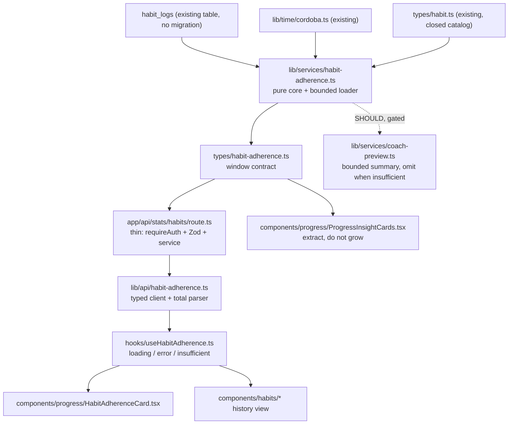
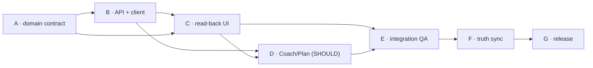

# Atlas Fitness v0.9.0 — Habits & Adherence — Product + Architecture Brief

**Status:** Discovery output — NOT approved, NOT implemented. Requires Product (PO) and Architecture approval before any execution wave starts.
**Type:** Discovery + architecture brief only. No product code, no behavior change, no PR, in this deliverable.
**Scope:** Atlas Fitness v0.9.0 "Habits & Adherence".
**Baseline:** `develop` @ `933258252130e8a9f86f6fc8ce47353dc4f77532` (`Merge pull request #161 from EstebanIndiveri/chore/release-sync-v0.8.0`), `package.json` version `0.8.0`.
**Companion ADRs:** `docs/architecture/ADR-001-system-stack.md`, `ADR-001b-habit-motivation.md`, `ADR-002-client-channels.md`, `ADR-003-gemini-guided-session.md`, `ADR-004-sessions.md`, `ADR-005-ownership-catalog.md`.

---

## 1. Phase 0 — Preflight verification (verified, not asserted)

| Check | Command | Result |
|---|---|---|
| HEAD SHA | `git rev-parse HEAD` | `933258252130e8a9f86f6fc8ce47353dc4f77532` |
| Baseline | `git rev-parse origin/develop` | identical SHA; HEAD is an ancestor of `origin/develop` |
| Worktree cleanliness | `git status --porcelain` | empty |
| Open PRs | `gh pr list --state open` | `[]` |
| Version | `package.json` | `0.8.0` |

**Gate result: PASS.** Discovery ran against a verified, clean, current baseline. `v0.8.0` is treated as closed and is not reopened or redesigned by this brief.

---

## 2. Phase 1 — Discovery method and evidence surface

Targeted reads only (no directory-wide dumps), plus two independent LOW-reasoning explore workers on two genuinely disjoint factual questions (Progress/adherence facts; Profile/Coach context facts). Workers were released after their output was incorporated; their findings are cited inline and were cross-checked by the parent against the cited files.

Surfaces read: `types/*`, `lib/db/schema.ts`, `lib/services/{habit-logs,streaks,weekly-consistency,progress-summary,strength-progress,daily-checkin,coach-preview,coach-recommendation,guided-training-plan-input}.ts`, `lib/ai/weekly-plan-prompt.ts`, `lib/api/habits.ts`, `lib/time/cordoba.ts`, `app/api/{habits,checkin,workouts,stats/week,stats/streak,cron/*}/route.ts`, `components/{habits,today,progress,profile,shell}/*`, `hooks/useHabits.ts`, `lib/copy/{progress,today,ui}.ts`, `e2e/*`, `jest.config.ts`, `CHANGELOG.md`, `docs/architecture/ADR-001b-habit-motivation.md`, `docs/backlog/README.md`, `docs/superpowers/specs/2026-09-26-weekly-plan-strategy-composer-design.md`.

**Dominant constraint discovered:** the **DATA HONESTY RULE** is not a stylistic preference in this repo — it is a typed, tested doctrine. `types/metric.ts` defines `MetricSource = 'user_input' | 'atlas_computed' | 'external_integration' | 'ai_recommendation'` and `Metric<T>` cannot be rendered without declared provenance; `lib/services/habit-logs.ts`, `lib/db/schema.ts` (habit table comment), `types/week.ts`, and existing habit tests ("never fabricates habit target values or progress percentages", "keeps steps and sleep as honest toggle rows instead of fabricating values") all enforce it. Every v0.9.0 decision below is constrained by it.

---

## 3. Phase 2 — Current-state truth matrix

Classification vocabulary: **EXISTS+PRODUCTION-BACKED** (written, read, rendered, tested) · **EXISTS+PARTIAL** (works but a narrow or weaker form) · **UI ONLY** (rendered without a backing contract) · **DATA EXISTS BUT UNUSED** (persisted, no read path) · **NOT IMPLEMENTED** · **INTENTIONALLY DEFERRED** (deliberate prior decision) · **UNKNOWN**.
Evidence labels: **FACT** (verified in the cited path) · **INFERENCE** (derived from verified facts) · **OPPORTUNITY** (product judgment).

| # | Capability | Class | Evidence | Label |
|---|---|---|---|---|
| 1 | Habit catalog definition (create habits) | NOT IMPLEMENTED | `types/habit.ts` exposes a closed constant `HABIT_KEYS = ['hydration','walk','mobility','sleep']`; no table, no create path | FACT |
| 2 | Habit catalog read | EXISTS+PRODUCTION-BACKED (static) | `types/habit.ts`, `components/habits/habit-catalog.ts` (`HABIT_PREVIEWS`, `countCompletedHabits`) | FACT |
| 3 | Habit completion for today | EXISTS+PRODUCTION-BACKED | `POST /api/habits` → `setHabitLog` (Zod-validated upsert) → `habit_logs`; UI `hooks/useHabits.ts` optimistic toggle with rollback | FACT |
| 4 | Quantitative habit amount | EXISTS+PARTIAL | `QUANTITATIVE_HABIT_KEYS = ['hydration']`; step 0.25 L, max 20 L; `habit_logs.amount` text; cleared when `done=false` | FACT |
| 5 | Habit history persisted | DATA EXISTS BUT UNUSED | `habit_logs` rows accumulate per `(user_id, local_date, habit_key)` with index `habit_logs_user_id_local_date_idx`; **no range query, no endpoint, no UI reads them back** | FACT |
| 6 | Habit history read path | NOT IMPLEMENTED | Only `getHabitLogsForDate(userId, localDate)` (single date) and `getTodayHabitLogs`; client only calls `fetchTodayHabitLogs()` | FACT |
| 7 | Habit adherence / consistency metric | NOT IMPLEMENTED | No `adherence` symbol exists outside test names; no habit input to any metric | FACT |
| 8 | Habit adherence UI | UI ONLY (declares its own absence) | `components/progress/ProgressInsightCards.tsx` `HabitConsistencyCard` renders only **today's** `doneByKey` plus `PROGRESS_COPY.habits.todayOnly` = "Hoy registraste N de 4 hábitos; eso no se muestra como porcentaje histórico." + empty body "Todavía no hay historial suficiente para calcular consistencia por hábito." | FACT |
| 9 | Habit editing (rename/retarget/reorder/unit) | NOT IMPLEMENTED | no such path anywhere | FACT |
| 10 | Habit archive/delete | NOT IMPLEMENTED | `habit_logs` has no `deletedAt`; no destructive habit operation exists | FACT |
| 11 | Habit schedule / frequency / targets | INTENTIONALLY DEFERRED | `habit_logs` column comment: "no targets, ratios, or progress percentages are fabricated (DATA HONESTY RULE)"; today copy: "No hay metas ni métricas automáticas." | FACT |
| 12 | Habit reminders | NOT IMPLEMENTED | Only outbound reminder is `streak_nudges` (`rule = active_yesterday_not_today`) via Telegram; prompts read "No reminders scheduled yet" for habits | FACT |
| 13 | Training completion | EXISTS+PRODUCTION-BACKED | `workouts.endedAt` + unique active workout index in `lib/db/schema.ts` | FACT |
| 14 | Session history | EXISTS+PRODUCTION-BACKED | `getProgressSummary(userId, period)` → `sessions[]` with routine name, date, duration | FACT |
| 15 | Weekly consistency (training) | EXISTS+PRODUCTION-BACKED | `computeWeekConsistency(today, activeDates)` + `GET /api/stats/week`; Monday-first; every value `atlas_computed` | FACT |
| 16 | Streak | EXISTS+PRODUCTION-BACKED | `lib/services/streaks.ts`; active-day rule = ended non-deleted workout **OR** `daily_checkins` row for that Córdoba date | FACT |
| 17 | Adherence including habits | NOT IMPLEMENTED | the active-day rule in (16) has no habit term | FACT |
| 18 | Wellness check-in (mood/energy/note) | EXISTS+PRODUCTION-BACKED | `daily_checkins` unique `(user_id, local_date)`; `POST /api/checkin`; `energy` CHECK `low|medium|high`, nullable for legacy mood-only rows | FACT |
| 19 | Prompt "Mood & energy" block | EXISTS+PRODUCTION-BACKED | Today screen composes `MoodEnergyCheckIn` | FACT |
| 20 | Routine completion / logged sets | EXISTS+PRODUCTION-BACKED | `workouts`, `workout_sets`; volume computed in `strength-progress.ts` | FACT |
| 21 | Adherence contract documented | EXISTS+PRODUCTION-BACKED | `types/week.ts` doc-comment defines the active-day rule and provenance | FACT |
| 22 | Adherence exposed via API | EXISTS+PRODUCTION-BACKED | `GET /api/stats/week`, `GET /api/stats/streak` | FACT |
| 23 | Habit → adherence link | NOT IMPLEMENTED | none | FACT |
| 24 | Coach ← adherence / habit consumption | NOT IMPLEMENTED | grep for habit/adherence symbols across `lib/services/coach-*`, `lib/services/guided-training-plan*`, `lib/ai/*` returns only a test cleanup; adapters read routine, `energy`, `mood`, optional `freeText` only | FACT |
| 25 | Coach adaptation preview | EXISTS+PRODUCTION-BACKED (read-only) | `lib/services/coach-preview.ts`; mood/energy fall back to today's check-in | FACT |
| 26 | Coach mutation authority | EXISTS+PRODUCTION-BACKED (gated) | the ONLY state-changing path is a user-initiated adapted workout start with `adaptation.result` + optional `dailyCheckInId`/`checkInContext` in `app/api/workouts/route.ts`; recommendations persisted with `decision ∈ {pending,accepted,rejected}` and `contextSnapshotJson = {mood, energy, freeText?}` | FACT |
| 27 | Manual plan editor | EXISTS+PRODUCTION-BACKED | `app/dashboard/plan/[id]/edit` + `GET/PATCH /api/training-plan/[id]` | FACT |
| 28 | Guided plan generation | EXISTS+PRODUCTION-BACKED | `app/api/training-plan/generate`; brief fields taken from the **request body**; composite input `guidedTrainingPlanSchema` with `mutationId` + SHA-256 payload hash for idempotent save | FACT |
| 29 | Weekly plan Gemini prompt | EXISTS+PRODUCTION-BACKED | `lib/ai/weekly-plan-prompt.ts` inputs: goal, days, experience, equipment, session length, focus areas, exercise catalog, optional current plan; prompt forbids inventing ids/biometrics/guarantees | FACT |
| 30 | Plan ↔ adherence input | NOT IMPLEMENTED | the generation route reads nothing from server-stored activity; **improve-plan hardcodes `experience: 'intermediate'`, `sessionLengthMinutes: 55`** | FACT |
| 31 | Profile / "Mi Atlas" persisted preferences | EXISTS+PARTIAL (under-consumed) | `user_preferences` (goal/pace/equipment, CHECK-constrained, nullable); written by onboarding finish + `PUT /api/profile/preferences`; readable via `GET`; **only consumer is client-side prefill (`useGuidedPlan`) and the preferences API itself** | FACT |
| 32 | Preference → plan influence | EXISTS+PARTIAL | purely indirect via client-side form defaults; server-side generation ignores stored preferences | FACT |
| 33 | Cross-device persistence | EXISTS+PRODUCTION-BACKED (server) / PARTIAL (client) | Turso/libSQL + Drizzle, ownership by `userId`; but `useHabits` loads and holds **today only**, so continuity is invisible across devices even though rows persist | FACT |
| 34 | Cross-user ownership / isolation | EXISTS+PRODUCTION-BACKED | `userId` FK + `requireAuth` on `app/api/habits/route.ts` and every stats route; unique indexes scoped per user; `userId` never accepted from the client | FACT |
| 35 | Explicit confirmation before mutation | EXISTS+PRODUCTION-BACKED (plans/coach) / N-A (habits) | plan replacement requires comparison + explicit confirm; coach requires user-initiated start. Habit toggles are immediate and non-destructive | FACT |
| 36 | AI habit recommendations | NOT IMPLEMENTED | no AI surface for habits; every AI prompt in the repo forbids invention | FACT |
| 37 | Habit entry point | EXISTS+PARTIAL | `/dashboard/habits` is reachable only from Ajustes → row `habits-settings`. Bottom nav (`components/shell/nav-links.ts` `APP_NAV_LINKS`) is Today / Entrenamiento / Progreso / Perfil only | FACT |
| 38 | Habit coverage in automated tests | EXISTS+PRODUCTION-BACKED (today only) | 41 habit-related Jest tests across `lib/services/habit-logs.test.ts`, `app/api/habits/route.test.ts`, `hooks/useHabits.test.ts`, `components/today/TodayHabitsCard.test.tsx`, `app/dashboard/habits/page.test.tsx`; `e2e/ux-habito.spec.ts` asserts exactly 4 rows and "0 de 4 completados" | FACT |
| 39 | Adherence coverage in automated tests | EXISTS+PRODUCTION-BACKED | `e2e/streaks.spec.ts` (incl. TZ double-count + cron idempotency), `e2e/cron.spec.ts` | FACT |
| 40 | Observability for stats reads | UNKNOWN | no evidence of per-endpoint metrics/tracing for `/api/stats/*` was found; not disproven | UNKNOWN |

### 3.1 Truth-honesty defects found in the existing UI (not caused by v0.9.0; must not be silently worsened)

| Defect | Evidence | Label |
|---|---|---|
| Card titled "Hábitos consistentes" computes **no historical consistency** | `ProgressInsightCards.tsx` / `lib/copy/progress.ts` | FACT |
| "Bienestar registrado" card renders today-only check-in data while sitting under the month/quarter period tabs | `ProgressInsightCards.tsx` + `lib/api/checkin.ts` (today only) | FACT |
| "Compartir progreso" and "Notificaciones" header buttons render with **no handlers** | `components/progress/ProgressHeader.tsx` | FACT |
| Recent-session rows always print "Volumen no disponible" although volume is computed for the same sessions | `RecentSessionsCard.tsx` vs `lib/services/strength-progress.ts` | FACT |
| Implied capability: "Hábitos de bienestar" row description "Ver actividad y hábitos" promises activity that has no read path | `app/dashboard/settings/page.tsx` | FACT |

These five are recorded as **pre-existing** honesty defects. v0.9.0 MUST fix the two that are directly in its path (#1 and #2, both habit/adherence or window-labeling) and MUST NOT introduce new ones. #3–#5 are logged as candidates, not silently absorbed into scope.

### 3.2 Structural summary of the truth matrix

- The **write** side of habits is complete and tested; the **read** side does not exist. Habits are write-only.
- **Adherence exists but has exactly one definition** (ended workout OR check-in), and habits are not part of it. `habit_logs` is the only user-entered daily-positive behavior that is invisible to every derived metric.
- **The schema already supports the entire MUST scope of v0.9.0 without a migration.** `habit_logs` has `localDate` plus the `(user_id, local_date)` index. A windowed read is a pure additive query.
- **The product already advertises the missing capability** ("Hábitos consistentes", "Ver actividad y hábitos") while the domain refuses it. Closing that gap is the highest-value, lowest-risk move available.
- **Nothing in Coach or Plan consumes adherence**, and improve-plan hardcodes experience and session length. This is the largest latent product gap found, and it is *blocked on* the habit read path, not on new AI work.

---

## 4. Phase 3 — Problem statement

**Root problem: Atlas lets a user record habits but cannot remember them, and therefore cannot hold them accountable to anything.**

Four consequences, each traceable to the matrix above:

1. **Habits are ephemeral and write-only.** A habit row persists in `habit_logs`, but the only read path is "today". At Córdoba midnight a user's entire habit history becomes unreachable. The user's only feedback is a checkbox that resets. There is no continuity, no "I have been doing this", and no record they can inspect. (Matrix #5, #6)
2. **Adherence is blind to the behavior users actually enter daily.** The active-day rule counts workouts and check-ins. A user who logs mobility, a walk, and hydration every single day but trains twice a week reads as non-adherent — a statement that is not merely unhelpful but *false* about their recorded behavior. (Matrix #13, #17)
3. **The product promises a capability the domain refuses.** Progress renders "Hábitos consistentes" and then explains it cannot compute habit consistency; Ajustes describes the habits row as "Ver actividad y hábitos" pointing at a screen with no activity and no history. (Matrix #8; defects #1, #5)
4. **The richest behavioral signal the user volunteered is stranded.** Coach and Plan generate recommendations from routine shape, mood, energy and free text, while the record of what the user actually does every day sits unread in the same database. (Matrix #24, #30)

**What the problem is NOT.** It is not a motivation deficit requiring rewards, and it is not a data-capture deficit requiring wearables or sensors. The data is already being captured, by hand, honestly, every day. The defect is **entirely on the read and interpretation side**: Atlas cannot compute anything from rows it already owns.

**Why now.** v0.8.0 closed plan/routine lifecycle and plan generation. The habit write path, the Córdoba time helpers, the `Metric<T>` provenance system, the `/api/stats/*` family and the streak/consistency services are all in place and tested. The read-back is now a small additive change rather than a new subsystem — which is exactly why it should be done *before* any new habit surface (creation, schedules, reminders) is layered on top.

---

## 5. Phase 4 — Product thesis (validation or challenge)

### 5.1 Framing verdict: **VALIDATE, with a sharpened definition**

"Habits & Adherence" is the correct wave. But as written it is ambiguous in a way that would let the execution drift into exactly what ADR-001b and the DATA HONESTY RULE forbid. The brief therefore fixes the definitions before any design:

> **Product thesis (v0.9.0).** Atlas should turn habits from an ephemeral daily checklist into a **persisted, user-owned behavior log with an honest read-back** — and that read-back becomes the one shared, typed signal that Progress may display and (optionally) Coach may consume, **without Atlas ever inventing a target, a percentage of a goal, a score, or a streak it cannot compute from stored rows.**

Four commitments the thesis implies:

1. **Read path before new surface.** Ship the ability to read `habit_logs` history before adding habit creation, schedules, targets or reminders. Adding surface to a write-only log reproduces the same dead end at greater cost.
2. **Adherence must be a countable fact, never a judged performance.** The only defensible denominator v0.9.0 owns is the **calendar**: days elapsed in the window. Counting "days on which you recorded at least one habit" over "days elapsed" is honest because both terms are stored facts. Counting anything over "your goal" is fabricated, because no goal is stored. (See §9 for the exact rule and §16 decision D2.)
3. **No targets unless the user declares them.** "3 de 4" is legitimate only as a *today* statement over a fixed catalog (as it exists today); it becomes dishonest the moment it is projected into a historical percentage. Any historical target requires an explicit, stored, user-declared frequency — which is **out of scope for v0.9.0** and gated on a decision.
4. **Coach reads, never invents.** If adherence reaches a prompt, it arrives as a bounded typed summary with explicit insufficient-data behaviour, is omitted rather than zero-filled when unreliable, is never framed as a judgment about the user, and never grants the Coach mutation authority over habits.

### 5.2 Alternative framings considered and rejected for v0.9.0

| Alternative framing | Why rejected |
|---|---|
| **"Habit Builder"** — habit creation, editing, cadence, per-habit goals, reminders | Inverts the thesis: builds writes on top of a log nobody can read, and pulls in a notification system (explicitly out). Also forces the 4-item catalog and `e2e/ux-habito.spec.ts` to change. Recommended as **v0.10.0 candidate**, gated on decision D1. |
| **"Habit Streaks"** — extend the streak rule to include habits | Cheapest perceived win, but it redefines an existing, tested, user-visible metric. A user's current streak would silently change meaning, and the change is irreversible once Telegram nudges reference it. Recorded as a deliberate **DEFER** with rationale. |
| **"Motivation & Rewards"** (Liftoff-adjacent) | Explicitly excluded by the wave brief. Also structurally dishonest in this product: a reward requires a target, and targets are forbidden by the honesty doctrine. |
| **"Adherence Score"** — one blended training + habit number | Fabricates a composite that no stored data supports and that no user asked for. Rejected; §9 forbids composites explicitly. |

### 5.3 The one thing this brief challenges in the original framing

The phrase "Habits & Adherence" implies the wave's job is to *build adherence*. It is not. **Adherence already exists and is production-backed for training** (`GET /api/stats/week`, `GET /api/stats/streak`). The wave's job is to **stop excluding habits from the definition that already exists**, and to make that definition visible and honest in one place. Scoping it as "build habit adherence" would produce a second, parallel metric system — the exact duplication AGENTS.md §10/§11 forbids.

**PRODUCT DECISION D1 is required before execution** (see §15).

---

## 6. Phase 5 — Contract: UX and state model

### 6.1 States (every surface, mandatory per AGENTS.md §10)

| State | Trigger | Required rendering |
|---|---|---|
| `loading` | request in flight | skeleton; **no zeroes, no empty defaults presented as data** |
| `today_recorded` | ≥1 habit row today with `done=true` | real toggles + real count |
| `today_unrecorded` | no `habit_logs` row for today | honest "unrecorded today" state (existing copy pattern) |
| `unavailable` | load failed / 401 | explicit unavailable state + session-expired copy; never empty defaults |
| `insufficient_history` | window has `< MIN_ELAPSED_DAYS` elapsed days or 0 habit rows in window | explicit insufficient-data state naming *why* |
| `available` | ≥ `MIN_ELAPSED_DAYS` elapsed days and ≥1 recorded day | the honest adherence rendering (§6.3) |

`today_unrecorded` and `insufficient_history` must be **distinguishable**. Conflating "you haven't logged today" with "we don't have enough history" is the exact ambiguity the current `HabitConsistencyCard` copy works around with a single vague sentence.

### 6.2 Surface-by-surface contract

**A. Hoy — `TodayHabitsCard` (contract preserved)**
Today-only remains today-only. The card keeps its real `N de 4` count over the fixed catalog and its honest hydration stepper. **No change to semantics.** One addition is permitted and recommended: a link to the habit history view. The existing `todayOnly` copy stays or is rewritten to point at where history now lives — it must not be deleted while the underlying claim changes.

**B. `/dashboard/habits` — Habits screen (extended, additive)**
Existing: today's toggles + hydration stepper + `unavailable` state. Added, read-only, above or below today's block:
- a period selector (`Semana` / `Mes` / `3 meses`) mirroring the Progress control,
- a per-habit strip of **recorded days** for the window — one mark per Córdoba day, weekday-labeled, Monday-first, future days rendered as inert (never as "missed"),
- an explicit window caption stating the exact dates and the timezone ("Hoy es <date> en Córdoba"),
- an `insufficient_history` state when the window is too young.

**Hard rule:** a missing day renders as **"sin registro"**, never as "fallado/incumplido/perdido". Absence of a row is not evidence of behaviour.

**C. Progress — `HabitAdherenceCard` (replaces the overpromising `HabitConsistencyCard`)**
- Same period control as its siblings; the card's numbers must actually follow the selected period (fixes defect #1 and the class of defect #2).
- Title must describe what is computed: recorded days, not "consistency"/"adherencia" quality.
- Renders `metric(activeDays, 'atlas_computed')` through `MetricValue` with source visible.
- Always renders the denominator as a fact about the calendar, labeled as such.
- `insufficient_history` state names the threshold.
- **Never** renders a percentage of a goal, a score, a grade, a badge, or a composite with training adherence.

**D. Progress — window-labeling fixes (tightly coupled, in scope)**
- The wellbeing card must state it is today-only, or the period control must not imply otherwise.
- The habit card's replacement removes the "Hábitos consistentes" overpromise.

### 6.3 The adherence presentation rule (normative)

For a window `[windowStart, windowEnd]` with `elapsedDays` elapsed days and `activeDays` days carrying at least one `done=true` habit row:

- **Permitted:** `activeDays`, `elapsedDays`, and the ratio expressed as a count pair — "Registraste hábitos en 5 de los 9 días transcurridos."
- **Permitted:** per-habit recorded-day counts.
- **Forbidden:** any value divided by a non-stored target; the words "meta", "objetivo", "cumplimiento", "score", "puntaje", "nivel", "racha" (in the habit context), "porcentaje de adherencia".
- **Forbidden:** a ratio whose denominator is not `elapsedDays` or a per-habit count of elapsed days.
- **Forbidden:** summing training adherence and habit adherence into one number.

This rule is directly testable and MUST be encoded as tests (see §13 and §14).

---

## 7. Phase 5 — Contract: domain and data

### 7.1 Data contract

**No migration is required for the v0.9.0 MUST scope.** Verified: `habit_logs` already stores `(user_id, local_date, habit_key, done, amount, created_at, updated_at)` with unique `(user_id, local_date, habit_key)` and index `(user_id, local_date)`; `localDate` is a Córdoba `YYYY-MM-DD` calendar string, which is directly range-queryable.

| Field | Change | Rationale |
|---|---|---|
| `habit_logs.*` | **unchanged** | the read path is additive |
| `habit_logs.deletedAt` | **not added** | no destructive habit operation exists or is proposed; adding soft delete without a delete feature is speculative schema |
| new `habit_definitions` table | **not added in MUST** | gated on decision D1; the closed catalog is preserved so `e2e/ux-habito.spec.ts` and all 41 habit tests stay valid |
| `user_preferences` | **unchanged** | preferences remain the Coach/Plan profile, not habit config |

**Index/query margin.** Worst case is 4 habit rows per user per day. A 90-day window is ≤360 rows per user, served by the existing composite index. No pagination, caching layer, or materialization is warranted. Windows larger than 90 days MUST be rejected at the boundary rather than silently served.

### 7.2 Domain contract (new module)

New service `lib/services/habit-adherence.ts`, deliberately mirroring the proven `weekly-consistency.ts` shape — **a pure, deterministic core plus a thin DB loader** — so it is unit-testable without a database and reusable by both the API and any future Coach consumer.

```
computeHabitAdherence(input: HabitAdherenceInput): HabitAdherenceWindow   // pure
getHabitAdherenceForUser(userId, period, now?): Promise<HabitAdherenceWindow>  // loader
loadHabitActivityInWindow(userId, windowStart, windowEnd): Promise<HabitLog[]>  // bounded read
```

```ts
export interface HabitDayAdherence {
  localDate: string;        // Córdoba YYYY-MM-DD
  weekdayIndex: number;     // Monday-first, 0..6
  isToday: boolean;
  isFuture: boolean;        // never counted, never rendered as missed
  recordedKeys: HabitKey[]; // keys with done === true on this date
  isRecorded: boolean;      // recordedKeys.length > 0
}

export interface HabitAdherenceWindow {
  period: 'week' | 'month' | 'quarter';
  windowStart: string;           // Córdoba YYYY-MM-DD, inclusive
  windowEnd: string;             // Córdoba YYYY-MM-DD, inclusive
  elapsedDays: number;           // days in window that are not future
  activeDays: number;            // days with isRecorded === true
  perHabit: Record<HabitKey, { activeDays: number }>;
  days: HabitDayAdherence[];     // ordered ascending, one per calendar day
  status: 'available' | 'insufficient';
  minimumElapsedDays: number;    // echoed so the UI can explain the threshold
}
```

### 7.3 Normative domain rules

1. **`done === true` is the only recording signal.** `amount` alone does not mark a day recorded. (Today the two coincide, because `setHabitLog` clears the amount when `done=false`; the rule is stated so a future amount-only habit cannot silently change meaning.)
2. **Future days are excluded from `elapsedDays` and rendered inert.** They are never "missed".
3. **Window definition by period, in Córdoba, Monday-first:**
   - `week`: `windowStart = addLocalDateDays(today, -localDateWeekdayIndex(today))`, `windowEnd = windowStart + 6`. This is the **existing** `computeWeekConsistency` definition and MUST match it exactly.
   - `month`: the last 30 Córdoba days including today — matching the existing `progress-summary.ts` month convention rather than a calendar month, for coherence with the sibling cards.
   - `quarter`: the last 90 Córdoba days including today.
   Either `progress-summary.ts`'s existing window constants are imported/reused, or the deviation is documented in code. Silent divergence between the two window definitions on the same screen would be a defect.
4. **`elapsedDays` is clamped to today.** No future day inflates the denominator.
5. **`status = 'insufficient'` when `elapsedDays < MINIMUM_ELAPSED_DAYS` or `activeDays === 0`.** When insufficient, `days`, `perHabit` and `activeDays` are still returned truthfully (the UI decides what to show) — the service never zero-fills to look complete.
6. **No composite, no target, no score is computed by this service.** It returns counts and a calendar; interpretation is copy, and copy is bounded by §6.3.
7. **Timezone:** only `lib/time/cordoba.ts` helpers. No `new Date()` arithmetic, no local-timezone math, no `UTC` derivation. Córdoba is fixed UTC−3 with no DST, which the helper module states explicitly.

### 7.4 Loader rule (performance, explicit)

`loadHabitActivityInWindow` MUST issue **one** bounded range query (`gte(localDate, windowStart)`, `lte(localDate, windowEnd)`, `eq(userId, ...)`) and group in a single in-memory pass. It MUST NOT:
- reuse `loadActiveDates` (semantically wrong — that rule excludes habits — and it is **unbounded**: it loads every ended workout and every check-in the user has ever created),
- query per day in a loop (N+1),
- query per habit (N+1).

This is a deliberate improvement on the existing pattern and must be stated in the service's JSDoc so a future contributor does not "unify" it back into `loadActiveDates`.

---

## 8. Phase 5 — Contract: API

### 8.1 Chosen surface: `GET /api/stats/habits?period=week|month|quarter`

**Why `/api/stats/*` and not `/api/habits/history`:** the repo already establishes `/api/stats/*` as the family of *derived, authenticated, `atlas_computed` activity snapshots consumed by cards* (`/api/stats/week`, `/api/stats/streak`, `/api/stats/prs`, `/api/stats/exercise/[id]/history`). Habit adherence is exactly that. `/api/habits` is the *user-input write + today read* surface. Keeping the two roles in the two existing families means **zero change to `GET /api/habits` and to `lib/api/habits.ts`**, so every existing habit test and `e2e/ux-habito.spec.ts` stay valid.

| Aspect | Contract |
|---|---|
| Method / path | `GET /api/stats/habits` |
| Query | `period` ∈ `week`\|`month`\|`quarter`; default `week`; unknown value → `400 VALIDATION` |
| Auth | `requireAuth(request)`; `userId` from the session only, never from query or body |
| Success 200 | `HabitAdherenceWindow` from §7.2 |
| Errors | existing `{ code, message }` via `handleApiError`; `400 VALIDATION`, `401 UNAUTHORIZED`, `429` if the existing limiter applies |
| Window cap | a period implying >90 days is rejected; the 90-day quarter is the maximum |
| Mutation | **none.** This endpoint is read-only and has no side effects |
| Route thinness | `requireAuth` → Zod-parse query → service → `NextResponse.json` → `handleApiError`, exactly like `app/api/stats/week/route.ts` |

### 8.2 Client contract

`lib/api/habit-adherence.ts` mirrors `lib/api/habits.ts` exactly: a typed `HabitAdherenceClientError` with `kind ∈ {unauthorized, validation, generic}`, a total response parser (returns `null` on any shape mismatch rather than trusting the body), and es-AR error messages. Mirrored again by `hooks/useHabitAdherence.ts` with the `useHabits` loading/error/rollback discipline — except there is no rollback because there is no mutation.

Parsing MUST validate `period`, `status`, `elapsedDays`, `activeDays`, `minimumElapsedDays`, and every `HabitKey` in `perHabit` against `isHabitKey`, rejecting unknown keys. A response containing an unknown habit key is a version-skew signal and must fail loudly rather than render partially.

### 8.3 Explicitly NOT part of the API contract

No `POST/PATCH/DELETE` habit-definition endpoints. No date-addressed habit write (`POST /api/habits` continues to write **today** only). No bulk habit write. No adherence mutation. Adding a write without a decision would be the first step toward the excluded surface list in §11.

---

## 9. Phase 5 — Contract: Progress metric definitions

Every metric below is `atlas_computed` unless stated. All windows are Córdoba calendar days, Monday-first for `week`.

| Metric | Source | Formula | Window | Minimum data | Insufficient-data behaviour |
|---|---|---|---|---|---|
| `habitActiveDays` | `habit_logs` | count of distinct `localDate` in window with ≥1 row `done=true` | selected (7/30/90) | ≥1 recorded day | card shows `insufficient_history` and explains the threshold |
| `habitElapsedDays` | calendar | count of window days `<= today` | selected | — | always computable; never 0 |
| `habitRecordedRatio` (**decision D2**) | derived | `habitActiveDays` over `habitElapsedDays`, rendered as "N de M días", **never as a percentage of a goal** | selected | ≥`MINIMUM_ELAPSED_DAYS` elapsed | not rendered as a ratio; counts only |
| `habitPerKeyActiveDays` | `habit_logs` | per `HabitKey`, count of distinct `localDate` with that key `done=true` | selected | ≥1 day for that key | that key shows "sin registro en el período" |
| `habitTodayCount` | `habit_logs` | today's `done=true` count over the **fixed 4-key catalog** | today | — | existing `today_unrecorded` state |
| `trainingActiveDays` (existing) | `workouts.endedAt` ∪ `daily_checkins.local_date` | `computeWeekConsistency(...).activeCount` | week | — | existing copy |
| `currentStreak` (existing) | `lib/services/streaks.ts` | unchanged | rolling | — | unchanged |

**Normative:**
- `habitActiveDays` and `trainingActiveDays` are **separate metrics with separate cards and separate labels.** They MUST NOT be combined, averaged, weighted, or presented as one "adherence" number (a composite is not derivable from stored facts and is forbidden by §6.3).
- Every user-facing number from these metrics MUST carry its `MetricSource`; `MetricValue` with `showSource` is the existing rendering path (`components/ui/MetricValue.tsx`).
- `habitRecordedRatio` is the single most honesty-sensitive value in the wave and is gated on decision D2. If D2 is rejected, the wave ships `habitActiveDays`/`habitElapsedDays` as two labeled counts only, which is still a complete and useful feature.
- **Definition of "adherence" for v0.9.0**, stated once so no two modules diverge: *the count of Córdoba calendar days on which the user recorded at least one habit, over the calendar days elapsed in the selected window.* Training adherence keeps its existing separate definition. Nothing else is adherence.

---

## 10. Phase 5 — Contract: Coach boundaries

### 10.1 What Coach may do with habits/adherence (SHOULD scope, gated on D4)

- **May read** a bounded, typed adherence summary as an optional input to (a) the adaptation preview context and (b) the weekly plan brief.
- **May not** receive raw habit rows, habit amounts, or per-key booleans. The summary is count-shaped, not diary-shaped.
- **May not** be told anything that implies a target, a judgement, or a capability limitation. The prompt block must describe recorded days only. Phrases like "el usuario es inconsistente", "está fallando", "no cumple la meta" are forbidden — the AI must not moralize about behavior the user merely recorded.
- **Insufficient data ⇒ the block is omitted entirely** from the prompt, never sent as zeros. Sending `0 de 0` would invite the model to invent a story about a new user.
- **Must not** be presented as the reason for a recommendation unless it genuinely contributed; the existing provenance discipline (`gemini` vs `fallback`, `library/audit`) applies unchanged.
- **Persistence:** if adherence influences an adaptation, it MUST be recorded in `coachRecommendations.contextSnapshotJson` (append-only extension of the existing `{mood, energy, freeText?}` snapshot). The `(workout_id, result_json)` unique key is unchanged, so idempotency semantics are preserved.

### 10.2 What Coach may never do (unchanged and re-affirmed)

- Never create, edit, archive, log, or un-log a habit.
- Never change the habit catalog.
- Never mutate state without an explicit user action: the ONLY state-changing path remains the user-initiated adapted-workout start in `app/api/workouts/route.ts`. This brief adds no new Coach mutation surface.
- Never generate habit recommendations as a standalone feature (matrix #36) — that would require inventing goals.
- The preview endpoint stays read-only.

### 10.3 Plan generation boundary

The weekly-plan prompt continues to accept exactly its existing inputs (`goal`, `days`, `experience`, `equipment`, `sessionLengthMinutes`, `focusAreas`, catalog, optional current plan) plus, at most, one optional adherence line. If adherence is added, it is treated as a brief input like the others — it does **not** silently persist into `user_preferences`, and it does **not** alter the plan lifecycle or the guided-save idempotency contract.

Separately recorded (not fixed by v0.9.0): the improve-plan path hardcodes `experience: 'intermediate'` and `sessionLengthMinutes: 55` instead of reading stored preferences or observed session data. This is a documented gap; changing it is **out of scope** for this wave and is logged as a v0.10.0 candidate.

---

## 11. Phase 5 — Contract: Habits (catalog, creation, editing, archive, schedule)

### 11.1 v0.9.0: the catalog is closed and immutable

`HABIT_KEYS = ['hydration','walk','mobility','sleep']` and `QUANTITATIVE_HABIT_KEYS = ['hydration']` remain the product's entire habit vocabulary. `types/habit.ts` stays the single source of truth for FE and BE.

Consequences, all favorable:
- `e2e/ux-habito.spec.ts` (asserts exactly 4 list items and "0 de 4 completados") stays valid with **no edit**.
- All 41 habit tests stay valid.
- No migration, no backfill, no dual-read.
- The "N de 4" today statement remains honest because 4 is a real, closed catalog, not a target.

### 11.2 Not in v0.9.0, and why each is a separate decision

| Capability | Status | Reason |
|---|---|---|
| Habit creation / removal | DEFER (D1) | requires `habit_definitions`, a migration, catalog-versioned history, and changes to the 4-item E2E contract |
| Rename / reorder / re-icon | DEFER | presentation on top of creation |
| Per-habit unit or measurement change | DEFER | would invalidate stored `amount` text semantics |
| Habit cadence / schedule / frequency | DEFER | this is a **target** by another name; §6.3 forbids rendering it as a goal, and no stored target exists |
| Archive / delete / soft delete of a habit | DEFER | requires a destructive-operation confirmation contract that does not exist for habits; adding the schema field without the feature is speculative |
| Back-dated habit correction | DEFER (see D3) | `setHabitLog` already accepts an arbitrary `localDate` at the service layer, so this is a small feature — but exposing date-addressed writes is a product decision about whether history is a *record* or an *editable ledger* |
| Habit reminders | DEFER (explicitly out) | see §12 |

### 11.3 Explicit confirmation rule

The repo's established pattern is: any mutation that replaces or discards user-owned state requires an explicit, informed confirmation (plan replacement shows an ANTES/PROPUESTA comparison; Coach adaptation requires the user to start the adapted workout; onboarding import requires a preview).

**In v0.9.0 no new habit mutation exists, so no new confirmation surface is required.** If D1 or D3 is approved, the corresponding confirmation contract MUST be designed before implementation, following the plan-replacement precedent — never as a bare destructive action. Silent destructive operations are forbidden by the harness.

---

## 12. Phase 5 — Contract: reminders, notifications, channels (out of scope)

Recorded so the exclusion is explicit rather than accidental:

- Telegram is the only outbound reminder channel today (`notifyLinkedTelegramUsers`, `TELEGRAM_COPY.reminderAtRisk`), driven by `app/api/cron/streak-nudge/route.ts` under `CRON_SECRET` and made idempotent by `streak_nudges` unique `(user_id, local_date, kind)`.
- **v0.9.0 adds no reminder rule, no notification preference, no digest, no new channel, no cron change.** Habit reminders require a notification-preference system, quiet hours, and a per-habit schedule model — a subsystem, and one explicitly outside the wave boundary.
- Explicitly **not** part of v0.9.0: push notifications, email, Telegram Mini App (ADR-002), habit nudges, "you haven't logged today" messages.
- One consequence worth stating plainly: because no reminder is added, the read-back must be **discovered by the user, not pushed to them.** This is a real limitation of the v0.9.0 boundary and is accepted knowingly.

---

## 13. Phase 5 — Contract: provenance and copy

- `lib/copy/progress.ts` (`PROGRESS_COPY.habits.*`) is the single source for the habit card's strings, as it already is; a new `PROGRESS_COPY.habitAdherence.*` group is added rather than scattering literals.
- The existing `todayOnly` string ("… eso no se muestra como porcentaje histórico") must be **rewritten, not deleted**, once the historical view exists — the sentence becomes false the moment it ships. Leaving a false sentence behind would be a self-inflicted honesty defect.
- Existing honest copy to preserve verbatim where still true: Today's "Atlas muestra solo valores registrados…" and the Habits screen's "Atlas muestra solo valores registrados manualmente. No hay metas ni métricas automáticas." The second sentence remains **true** under this brief and may stay.
- All new user-facing numbers pass through `Metric<T>` / `MetricValue` with a declared source.
- Empty-state and insufficient-state copy is user-facing product copy in `es-AR`, kept in `lib/copy/*`, never inlined in JSX.

---

## 14. Phase 6 — Architecture mapping

### 14.1 Target layering (fits the existing repo shape; no new pattern invented)



### 14.2 File-by-file plan (paths, ownership, and the reason)

| Path | Action | Reason |
|---|---|---|
| `types/habit-adherence.ts` | **new** | repo convention is one type module per API surface (`types/week.ts` ← `/api/stats/week`; `types/streak.ts`; `types/metric.ts`). `HabitKey` is imported from `types/habit.ts`, never re-declared |
| `lib/services/habit-adherence.ts` | **new** | mirrors `weekly-consistency.ts` (pure `compute*` + `get*ForUser`), keeping the metric unit-testable without a DB |
| `app/api/stats/habits/route.ts` | **new** | stays in the existing derived-stats family; route is ~15 lines like `app/api/stats/week/route.ts` |
| `lib/api/habit-adherence.ts` | **new** | mirrors `lib/api/habits.ts` error/parse discipline |
| `hooks/useHabitAdherence.ts` | **new** | mirrors `hooks/useWeekConsistency.ts` / `useProgress.ts` |
| `components/progress/HabitAdherenceCard.tsx` | **new** | **required extraction**: `components/progress/ProgressInsightCards.tsx` is already **239 lines**, above the AGENTS.md §8 guidance of ~200–250. It must not absorb a new card; the new card lands in its own file and the superseded `HabitConsistencyCard` is removed or extracted alongside |
| `components/progress/ProgressInsightCards.tsx` | **edit (shrink)** | remove the mis-labeled card; fix the wellbeing window labeling |
| `lib/copy/progress.ts` | **edit** | single source for both new and rewritten strings |
| `components/habits/*`, `app/dashboard/habits/page.tsx` | **edit** | add the read-only history block; page stays thin (it is 22 lines today) |
| `hooks/useHabits.ts` | **unchanged** | today-only write/toggle contract is correct and tested; the new read is a separate hook |
| `app/api/habits/route.ts` | **unchanged** | preserves `e2e/ux-habito.spec.ts` and `app/api/habits/route.test.ts` |
| `lib/services/habit-logs.ts` | **possibly +1 function** | a windowed read may live here (data access) or in the new service (metric). **Decision: the bounded window query lives in `habit-logs.ts` beside `getHabitLogsForDate`** so `habit-logs.ts` remains the only module touching the `habit_logs` table, and `habit-adherence.ts` remains pure-domain. This is the layering that keeps both modules single-purpose |
| `lib/db/schema.ts` | **unchanged** | no migration in MUST |
| `lib/services/streaks.ts` | **unchanged** | the active-day rule must NOT gain a habit term in v0.9.0 (see §16 risk R3) |

### 14.3 Cross-cutting conventions applied

- **Time:** `lib/time/cordoba.ts` only. Week definition MUST reuse `localDateWeekdayIndex` + `addLocalDateDays` exactly as `computeWeekConsistency` does, so the habit week and the training week can never disagree about where Monday is.
- **Ownership:** `userId` from the auth session. No habit read accepts a `userId` parameter from the HTTP boundary.
- **Idempotency:** the wave is read-only in MUST, so no new idempotency surface. The existing `habit_logs` unique index continues to make `POST /api/habits` idempotent, and its tests are untouched.
- **Errors:** `{ code, message }` via `handleApiError`; the client maps `UNAUTHORIZED` → session-expired copy, `VALIDATION` → a real message, everything else → generic. No stack traces, no internal paths, no row data in error bodies.
- **Logging:** no new logging. No habit value, count, mood, energy or free text may appear in any log line; if a failure is logged it names the endpoint and the operation only.
- **Dead code:** the removed `HabitConsistencyCard` copy keys and any now-unused `PROGRESS_COPY` entries MUST be deleted in the same change (the harness forbids leaving commented "backup" code and unused exports).
- **Imports:** no new dependency. Everything needed (Zod, Drizzle, existing time helpers, `Metric`) is already present.
- **Testing split:** Jest for the pure core, the loader, the route, the client parser and the hook; Playwright for the end-to-end read-back and the insufficient-data path (`e2e/habit-adherence.spec.ts`), following the mobile-first precedent of `e2e/ux-habito.spec.ts`.

### 14.4 Scalability note

A read-only, index-served, 90-day-capped, 360-row-per-user query needs no caching, no materialization and no background job. If volume ever justifies optimization, the honest next step is a covering index or a per-user rollup table — **not** a fabricated percentage. Stated so that "make adherence faster" cannot be used later to justify inventing data.

---

## 15. PRODUCT DECISIONS requiring approval (blocking)

These are **product decisions, not engineering choices.** Each is stated with a recommendation, the reasoning, and the consequence of rejection. Execution MUST NOT begin before D1 and D2 are resolved.

### D1 — Does v0.9.0 include user-owned habit creation/editing? **Recommendation: NO.**

- **Context.** The catalog is a closed constant of 4 keys. Making habits user-owned requires a `habit_definitions` table, a migration, catalog-versioned history (what happens to logs of a deleted habit?), ownership rules, and changes to the 4-item assertion in `e2e/ux-habito.spec.ts`.
- **Why no.** It is a write-side feature, and the thesis is that the read side is the defect. Shipping creation without read-back reproduces the same dead end with more surface area, and it forces the first destructive-operation contract in the habits domain.
- **If YES is chosen instead:** the wave must be re-scoped; the 4-item E2E contract and the `HABIT_KEYS`-based parsers (`isHabitKey` in the client response parser) become versioned concerns, and archive/delete semantics need their own ADR.

### D2 — Is `habitActiveDays / habitElapsedDays` an acceptable "adherence" surface under the DATA HONESTY RULE? **Recommendation: YES, as counts ("N de M días"), never as a percentage of a goal.**

- **Reasoning.** Both terms are stored or calendar facts: "days on which you recorded ≥1 habit" and "days elapsed in the window". No target, goal, expectation or judgement is introduced. A user-declared service that produces exactly the numbers their own rows contain cannot be fabrication.
- **The line.** The moment the denominator becomes anything other than elapsed calendar days — a goal, an ideal, a peer average, a recommended frequency — the value is fabricated and forbidden. If an implementation ever wants a "porcentaje de cumplimiento", that is D1/D5 territory, not D2.
- **If NO is chosen:** v0.9.0 ships only `habitActiveDays`, `elapsedDays`, per-habit recorded-day counts and the inert day strip. This is a smaller but still complete feature; it removes the ratio from §9 and from §6.3.

### D3 — May a user correct or back-fill a past habit day? **Recommendation: NO for v0.9.0.**

- **Context.** `setHabitLog` already accepts an arbitrary `localDate` at the service layer; `/api/habits` deliberately exposes **today only**. Exposing a date-addressed write is a small feature with a large semantic consequence: it converts habit history from a *record* into an *editable ledger*, and it makes "recorded today" a claim that can be retro-fitted — which affects the meaning of every adherence number in §9 and of any future nudge.
- **If YES:** requires an explicit confirmation contract for rewriting history, plus copy that distinguishes "recorded on the day" from "recorded later", and the honesty copy in §13 must change again.

### D4 — Is Coach/Plan consumption of adherence MUST or SHOULD? **Recommendation: SHOULD, and gated behind the read path shipping first.**

- **Reasoning.** It is the highest-upside part of the wave but also the highest-risk for honesty: it is the only place where a model could editorialize about the user's behaviour. It must land only after the numbers themselves are verified and trusted, and it must degrade to omission when data is insufficient.
- **If MUST:** the wave gains a prompt change, a snapshot-format extension and a cross-domain review dependency; the release boundary in §17 must be updated accordingly.

### D5 — Minimum-`elapsedDays` threshold for showing adherence. **Recommendation: 7 elapsed days.**

- **Reasoning.** Below a week, a ratio is noise and the insufficient-data state is more honest than the number. The threshold is echoed in `minimumElapsedDays` so the UI can explain it and so tests can assert it without hardcoding a second copy of the constant. **Changeable without re-architecture** — it is a named constant, and the UI reads it from the API rather than owning its own copy.

### D6 — Is fixing the "Bienestar registrado" today-only-under-month-tab defect in scope? **Recommendation: YES (small, same screen, same class of defect).**

- **Reasoning.** It is the same defect class as the habit card being fixed, on the same screen, discovered by this discovery. Leaving one honesty defect while fixing its twin is harder to justify than fixing both. If PO prefers a tighter diff, the minimum acceptable action is a window label on the card rather than removing the card.

---

## 16. Phase 7 — Risks and mitigations

### R1 — Honesty regression: rendering a number that implies a target. **Severity: CRITICAL. Likelihood: HIGH if unguarded.**

The single failure mode that would make this wave worse than doing nothing. The moment a "% de adherencia" or a "cumplimiento" appears, Atlas has fabricated a goal on behalf of the user.

- **Mitigation:** §6.3 is normative and directly testable; the denominator is fixed to `elapsedDays`; the forbidden vocabulary list is explicit; `habitRecordedRatio` is gated on D2 and removable without re-architecture.
- **Encoded as tests:** a Jest test asserting the card and the service never emit a goal-relative value; a copy test asserting no forbidden token appears in the rendered habit strings; a parser test asserting `perHabit` rejects unknown keys. A regression here must fail CI, not depend on review vigilance.
- **Residual:** the word "adherencia" itself is a risk if used in a title. Card titles must describe computed content ("Días con registro"), not quality.

### R2 — Silently changing the meaning of an existing, user-visible metric. **Severity: HIGH. Likelihood: MEDIUM.**

`currentStreak`, `week.activeCount` and the streak nudge all key off the active-day rule. Adding habits to that rule would change what a user's current streak means, retroactively, and would change nudge eligibility for real users.

- **Mitigation:** `lib/services/streaks.ts` is explicitly **unchanged** in v0.9.0. Habit adherence is a new, separate metric. `e2e/streaks.spec.ts` (including the TZ double-count test) must stay green untouched, which is the mechanical proof that streak semantics did not move.
- **Residual:** users will reasonably ask for habits in the streak. That is a deliberate, documented DEFER (§17) with an ADR note, not an oversight.

### R3 — Timezone / window-boundary bugs. **Severity: HIGH. Likelihood: MEDIUM.**

Córdoba is UTC−3 year-round with no DST (simplifies the class), but the `week` window must be Monday-first and clamped to today, and the `month`/`quarter` conventions must match the sibling Progress cards. A one-day drift would make the habit card visibly disagree with the training card beside it.

- **Mitigation:** reuse `localDateWeekdayIndex`/`addLocalDateDays`; reuse the existing window constants rather than re-deriving them; unit-test at 00:00 and 23:59 Córdoba, at Monday/Sunday boundaries, at month and year boundaries, and on a leap-day window. Test that a future day inside the window is inert and excluded from `elapsedDays`.
- Also test the negative: an instant that is a different calendar date in UTC than in Córdoba must resolve to the Córdoba date (mirrors the existing `streaks` and `habit-logs` TZ tests).

### R4 — N+1 / unbounded query. **Severity: MEDIUM. Likelihood: MEDIUM.**

The tempting reuse is `loadActiveDates`, which is semantically wrong (it excludes habits) **and** unbounded (it loads every ended workout and check-in the user ever created). Copying that shape for habits would put an ever-growing scan on a screen the user opens often.

- **Mitigation:** §7.4 makes the single bounded range query normative; the loader's JSDoc states why `loadActiveDates` must not be reused; a loader test asserts the query is date-bounded.
- **Residual:** low. 90 days × ≤4 habits = ≤360 rows, index-served.

### R5 — Breaking existing contracts and tests. **Severity: MEDIUM. Likelihood: LOW if §11.1 is respected.**

`e2e/ux-habito.spec.ts` asserts **exactly 4** habit list items and the literal "0 de 4 completados"; `lib/api/habits.ts` rejects unknown habit keys; 41 habit tests encode today-only semantics.

- **Mitigation:** `GET /api/habits`, `POST /api/habits`, `lib/api/habits.ts`, `hooks/useHabits.ts` and `types/habit.ts`'s key list are all **unchanged**. The new read is a different endpoint. Verified consequence: the existing habit and habit-E2E suites should pass with zero edits — that is an acceptance criterion, not an aspiration.
- **Residual:** if D1 is approved, this risk becomes HIGH and the E2E contract must be versioned deliberately.

### R6 — Coach editorializing about the user. **Severity: HIGH (trust). Likelihood: MEDIUM.**

Feeding a model "you recorded habits on 3 of 12 days" invites "parece que te está costando mantener el hábito". That is a judgement Atlas has not earned and cannot substantiate.

- **Mitigation:** §10.1 forbids judgement phrasing; the block is omitted entirely when insufficient; the summary is count-shaped and bounded; the preview stays read-only; the Coach gains no mutation authority. A prompt test asserts the adherence block is absent when `status === 'insufficient'`.
- **Residual:** managed by prompt review and by keeping the block optional — the feature works with the block absent.

### R7 — Scope creep into the excluded "Liftoff" surface. **Severity: HIGH (mandate). Likelihood: MEDIUM.**

"Adherence" naturally attracts streaks, badges, levels, XP and rewards — and habit streaks are a very small diff away from the current streak rule.

- **Mitigation:** §17 lists the exclusions explicitly; R2's "unchanged `streaks.ts`" rule is the mechanical guard; the pre-PR review MUST re-check the exclusion list against the diff.
- **Residual:** none if the list is checked.

### R8 — The read-back is undiscoverable. **Severity: MEDIUM (product value). Likelihood: HIGH.**

The Habits screen is reachable only from Ajustes, and no reminder exists.

- **Mitigation (in-scope):** the Progress card is the discovery surface — it lives on a nav tab — and it carries the entry link to the habit history. Today's habit card may link out too.
- **Out of scope:** bottom-nav changes and reminders; explicitly deferred per the brief.
- **Consequence stated honestly:** if Progress is not where this user looks, v0.9.0's value is partially latent. This is an accepted limitation of the release boundary and the strongest argument for the D4/SHOULD Coach consumption later.

### R9 — Over-consuming `user_preferences` / unrelated refactors. **Severity: LOW. Likelihood: LOW.**

Discovered gaps (server-side generation ignores stored preferences; improve-plan hardcodes `experience`/`sessionLengthMinutes`; "Compartir progreso"/"Notificaciones" are dead buttons; "Volumen no disponible" understates computed volume) are real but unrelated.

- **Mitigation:** logged as v0.10.0 candidates in §19, **not** absorbed. Fixing one honesty defect does not license fixing all of them in one PR.

---

## 17. Phase 8 — Release boundary

### MUST (v0.9.0 ships this, or it does not ship)

| ID | Item |
|---|---|
| M1 | `lib/services/habit-adherence.ts` — pure core + bounded loader, and a windowed read in `lib/services/habit-logs.ts` |
| M2 | `types/habit-adherence.ts` typed contract, with `HabitKey` imported from `types/habit.ts` (no re-declaration) |
| M3 | `GET /api/stats/habits?period=` — requireAuth, Zod, 90-day cap, read-only, `{code,message}` errors |
| M4 | `lib/api/habit-adherence.ts` typed client with a total response parser that rejects unknown habit keys |
| M5 | `hooks/useHabitAdherence.ts` with loading / error / insufficient states |
| M6 | `components/progress/HabitAdherenceCard.tsx` replacing the mis-labeled `HabitConsistencyCard`, honoring the selected period, with `MetricValue` source display and the §6.3 rendering rule |
| M7 | Habits screen read-back: period selector, per-habit recorded-day strip, explicit window + timezone caption, `insufficient_history` state |
| M8 | Copy: rewrite `PROGRESS_COPY.habits.todayOnly` so it is not false once history exists; add `PROGRESS_COPY.habitAdherence.*`; delete now-unused keys and the removed card |
| M9 | Honesty tests: no-goal/no-percentage assertions, insufficient-data states, unknown-key rejection, forbidden-vocabulary copy test |
| M10 | Window labeling fixed on the Progress screen for the wellbeing card (D6) so a period control never mislabels today-only data |
| M11 | `ProgressInsightCards.tsx` shrinks (extraction), staying within AGENTS.md §8 guidance |

**MUST invariants (acceptance-blocking):**
- No migration.
- `habit_logs`, `types/habit.ts`, `GET/POST /api/habits`, `lib/api/habits.ts`, `hooks/useHabits.ts`, `lib/services/streaks.ts`, `lib/services/weekly-consistency.ts` **unchanged**.
- All existing habit, streak, stats and E2E suites pass **without edits**.
- Every new user-facing number carries `MetricSource`.
- `elapsedDays` never counts a future day.

### SHOULD (include only if MUST is green and reviewed)

| ID | Item |
|---|---|
| S1 | Adherence as an optional bounded input to Coach adaptation preview (omitted when insufficient; recorded in `contextSnapshotJson`) |
| S2 | Optional adherence line in the weekly plan brief, treated as a brief input, never persisted into preferences |
| S3 | An entry point from Today's habit card into the habit history |
| S4 | A minimal `MetricValue` provenance display on the habit history header |

### DEFER (explicitly NOT in v0.9.0)

User-owned habit creation/editing/removal (D1) · habit archive/soft-delete/destructive operations · habit schedules, cadence, frequency, per-habit targets · back-dated habit writes (D3) · habit contributions to the streak or the active-day rule · habit reminders, notification preferences, digests, push, email · habit streaks with freeze/revive · composite training+habit adherence score · AI habit recommendations or AI-authored habit catalog · wearables / `external_integration` / auto-detected habits · habit data in the Telegram surface · Telegram Mini App (ADR-002) · bottom-nav changes · fixing the pre-existing dead Progress header buttons · the "Volumen no disponible" understatement · making server-side plan generation read stored `user_preferences` · removing improve-plan's hardcoded `experience`/`sessionLengthMinutes`.

### EXPLICITLY EXCLUDED — LIFTOFF

**Missions · XP · levels · badges · reward economies · progression systems · Liftoff-inspired navigation · engagement loops · any mechanic whose purpose is to increase returns rather than to record and report truth.**

These are outside MUST **and** outside SHOULD. Two structural reasons, recorded so the exclusion survives a future re-read: (1) every one of them requires a **target or a score**, which the DATA HONESTY RULE forbids Atlas from inventing, and (2) they are motivation mechanics, whereas this wave's defect is a missing read path. A reviewer who finds any of these in the diff has found a mandate violation, not a scope question.

**DEFER ≠ Maybe.** Every DEFER item above requires its own decision and its own brief.

---

## 18. Phase 8 — Execution wave design

### 18.1 Preferred chain

**Domain/data contract → Backend/API → Frontend (Habits + Progress) → Coach + Plan (SHOULD) → Integration QA → Truth Sync → Release.**

The order is not cosmetic. The contract must exist before the API so the API cannot invent a response shape; the API must exist before the UI so the UI cannot encode a metric the domain does not compute; QA must come after the UI so the end-to-end read-back is provable from the user's seat; Truth Sync must come after QA so documentation records verified behavior.

### 18.2 Workstreams

| WS | Identifier | Objective | Depends on | Ownership surface (exclusive) | Exclusions | Acceptance | Tests | Integration point | Reasoning |
|---|---|---|---|---|---|---|---|---|---|
| **A** | `habit-adherence-domain` | Pure metric core + bounded loader + typed contract | — | `lib/services/habit-adherence.ts`, `types/habit-adherence.ts`, +1 windowed read in `lib/services/habit-logs.ts`, their test files | no HTTP, no React, no schema change | deterministic `computeHabitAdherence`; Monday-first week matching `computeWeekConsistency`; future days inert; `elapsedDays` clamped; single bounded query | Jest: happy/edge/error incl. TZ boundaries, empty window, future day, unknown key guard, loader query bound | the exported window type consumed by B and C | **MEDIUM** |
| **B** | `habit-adherence-api` | Thin authenticated read endpoint + typed client | A | `app/api/stats/habits/route.ts`, `lib/api/habit-adherence.ts`, their tests | no mutation, no schema change, no UI | 200 shape == contract; 401/400 via `handleApiError`; >90d rejected; `userId` from session only | Jest route tests (200/400/401/malformed query) + client parser tests (unknown key rejected, non-JSON rejected) | C's hook calls the client | **LOW** |
| **C** | `habit-readback-ui` | Habits history read-back + Progress card | A, B | `components/progress/HabitAdherenceCard.tsx`, `hooks/useHabitAdherence.ts`, `components/progress/ProgressInsightCards.tsx`, `components/habits/*`, `app/dashboard/habits/page.tsx`, `lib/copy/progress.ts` | no new nav, no reminders, no habit write, no new catalog | every §6.1 state reachable; §6.3 rendering rule holds; `ProgressInsightCards.tsx` shrinks | Jest component tests incl. honesty-negative and forbidden-vocabulary copy tests | E proves it end-to-end | **MEDIUM** |
| **D** | `habit-adherence-coach` *(SHOULD, gated on D4)* | Bounded adherence input to Coach preview and the weekly plan brief | A, B, C | `lib/services/coach-preview.ts`, `lib/ai/weekly-plan-prompt.ts`, `app/api/workouts/route.ts` snapshot line, their tests | no Coach mutation authority; no habit creation; no persistence into `user_preferences` | block omitted when insufficient; snapshot recorded; preview read-only | Jest prompt tests (absent when insufficient, present when available, no judgement phrasing) | C shows the number D reasons about | **MEDIUM** |
| **E** | `habit-adherence-qa` | End-to-end proof of the read-back and the honest failure modes | A, B, C | `e2e/habit-adherence.spec.ts` (new only) | must not edit `e2e/ux-habito.spec.ts` or `e2e/streaks.spec.ts` | the §19 matrix rows for the habit surfaces pass at mobile viewport | Playwright, mobile-first like `ux-habito.spec.ts` | final gate before F | **LOW** |
| **F** | `habit-adherence-truth-sync` | Documentation matches verified behavior | A–E | `CHANGELOG.md`, `docs/backlog/README.md`, `docs/architecture/ADR-001b-habit-motivation.md` (addendum only), the handoff doc | no rewrite of closed v0.8.0 history; no new ADR unless D1/D3 is approved | every MUST and DEFER item reflected; no doc claims behavior tests do not prove | doc review against the E results | feeds G | **LOW** |
| **G** | `v0.9.0-release` | Cut the RC and land per AGENTS.md §3/§5 | F | release/version metadata only | no feature work; hotfixes only | CI green (lint, typecheck, Jest, Playwright Must); code review by a non-author agent; Architecture OK if any contract moved; PO OK on scope | existing CI + regression suite | — | **LOW** |

### 18.3 Dependency graph



Critical path: **A → B → C → E → F → G**. D is an off-path SHOULD branch that joins at E.

**Parallel-safe pairing.** Exactly one genuinely independent pair exists: **D and E** can run concurrently once C is green, because D touches Coach/Plan/prompt files and E touches only a new E2E spec — disjoint write surfaces, no shared state. F cannot start before E; nothing can start before A.

**Forbidden parallelism:** B and C must not run concurrently (C's hook consumes B's client), and two writers must never touch `components/progress/*` or `lib/copy/progress.ts` simultaneously (AGENTS.md §3/§4).

### 18.4 Reasoning and concurrency budget for the implementation wave

- **Parent/orchestrator: MEDIUM reasoning.** It owns the contract, the honesty rule and the cross-domain judgment — the only place where a wrong call is expensive.
- **Workers: LOW reasoning.** Every workstream is bounded by a written contract (§6–§11) and a written acceptance rule, so it does not require independent judgment. D is the one exception: it should escalate to MEDIUM if the prompt block's boundary wording is contested.
- **Maximum useful parallelism: 2.** Concretely: at most one LOW worker on the D prompt/adherence-block workstream and one LOW worker on the E Playwright spec, never more. A/B/C are a single contract-sensitive chain on one critical path and must be executed serially; spawning more workers would create writers on shared files, which the harness forbids outright. When only the critical path is active, the correct number of workers is **zero** — the parent executes it.
- **Escalation rule:** escalate to HIGH/MAX reasoning only on a genuine cross-domain contradiction — e.g. if D2's ratio and the honesty rule cannot be reconciled, or if a MUST invariant (unchanged `streaks.ts`) turns out to be impossible without breaking a contract. Absent such a contradiction, MEDIUM is the ceiling.
- **Context discipline:** workers receive the artifact's relevant section plus an explicit file list. They are never handed this conversation and never told to read the repository.

---

## 19. QA strategy, discovery gate and open items

### 19.1 Required QA matrix

Every row names the **contract actually proven** — not "the screen works". Rows marked *(post-D1)* become relevant only if D1 is approved; under the recommendation they instead prove the capability is **absent by design**.

| # | Scenario | Layer | Contract proven |
|---|---|---|---|
| 1 | Fresh user, first ever visit | E2E + Jest | `status='insufficient'`; no zeroes rendered as data; no fabricated ratio; the insufficient copy names the threshold from `minimumElapsedDays` |
| 2 | Existing user with ≥7 days of history | E2E + Jest | `activeDays` and `elapsedDays` equal the rows actually stored; the week card matches `computeWeekConsistency` day-for-day |
| 3 | No habits recorded in the window | Jest + component | `status='insufficient'`; every day renders "sin registro", never "fallado"; no ratio |
| 4 | Exactly one habit recorded today only | E2E | today's count is `1 de 4`; historical view shows 1 recorded day and an insufficient history state — the two are visually distinct |
| 5 | Multiple habits across several days | Jest | `perHabit` counts match per key; `activeDays` counts **distinct days**, so 4 habits on one day is 1 active day, not 4 |
| 6 | Check-in exists but no habit logged | Jest | training adherence (`week.activeCount`) and habit adherence move independently — proving the metrics are not conflated |
| 7 | Repeat / idempotency | Jest + API | two identical `POST /api/habits` bodies leave exactly one row (`(user_id, local_date, habit_key)` unique); `GET /api/stats/habits` is side-effect free — repeated reads change nothing |
| 8 | Missed day in the window | Jest + component | the missed day is counted in `elapsedDays` and **not** in `activeDays`; it renders inert, with no "failed" semantics |
| 9 | Córdoba TZ rollover | Jest | an instant whose UTC date differs from its Córdoba date resolves to the Córdoba date; a future day inside the window is excluded from `elapsedDays`; Monday-first boundary holds at 00:00 and 23:59 Córdoba |
| 10 | Edit a past day | *(post-D3)* | under the recommendation: `POST /api/habits` writes today only and no date-addressed endpoint exists — proven by a 400/404 style assertion, not assumed |
| 11 | Archive / delete a habit | *(post-D1)* | under the recommendation: no destructive habit operation exists in the API or the UI; `habit_logs` has no `deletedAt` |
| 12 | Logout / login persistence | E2E | history is server-backed: toggle, re-authenticate, and the recorded days are identical — proving the read-back is not client state |
| 13 | Cross-user isolation | Jest + API | user B's `GET /api/stats/habits` never counts user A's rows; a query/body `userId` is ignored; unauthenticated requests get 401 |
| 14 | Coach with insufficient habit data (D4) | Jest prompt | the adherence block is **absent** from the prompt, not zero-filled |
| 15 | Coach with sufficient habit data (D4) | Jest prompt | the block is present, count-shaped, judgement-free; the adaptation is still preview-only |
| 16 | AI unavailable | Jest | Gemini outage behaviour is unchanged and the deterministic fallback still runs; the habit read-back is unaffected because it is deterministic and has no AI dependency |
| 17 | Progress reads with insufficient / sufficient history | Component + E2E | both states reachable and distinguishable; no percentage of a goal in either; source labels rendered |
| 18 | Existing Plan/Coach flow unaffected | Regression | `e2e/plan-coach-profile-integration.spec.ts`, `coach-context.spec.ts`, `today-coach.spec.ts` pass unedited |
| 19 | Existing habits contracts unaffected | Regression | `e2e/ux-habito.spec.ts` (exactly 4 rows, "0 de 4 completados"), `e2e/streaks.spec.ts` (TZ + cron idempotency) pass **unedited** |
| 20 | Unavailable / session expired | Component | `unavailable` state renders; empty defaults are never presented as today's data |
| 21 | Window-cap boundary | API | a period implying >90 days is rejected with `400 VALIDATION` |
| 22 | Honesty negative | Jest (copy + component) | no forbidden token ("meta", "%", "objetivo", "cumplimiento", "puntaje", "racha" in habit context) appears in any habit adherence string or rendered output |

### 19.2 Verification commands (gate evidence, per AGENTS.md §13)

`npm run lint` · `npm run typecheck` · `npm test` · `npm run test:e2e` · `npm run build` — plus a fresh independent code review of the full diff by a non-author agent before any PR, and re-verification after every review finding is applied.

### 19.3 Discovery gate — self-check against the wave mandate

| Mandate | Status |
|---|---|
| No product code written | ✅ this session wrote exactly one document |
| No implementation PR opened | ✅ no PR created |
| v0.9.0 execution wave not started | ✅ workstreams are designed, not begun |
| No production behavior modified | ✅ no source file touched |
| No release recovery performed | ✅ out of scope, untouched |
| v0.8.0 not reopened or redesigned | ✅ treated as closed; only *noted* as the prerequisite baseline |
| Liftoff surface excluded | ✅ explicit exclusion section, outside MUST **and** SHOULD |
| Worker budget respected | ✅ max 2 concurrent, LOW reasoning, minimal packets, released after incorporation |
| ONE authoritative artifact | ✅ this file, in `docs/superpowers/specs/`, beside the prior wave spec |

**Stop conditions honored:** discovery terminated at the brief; no execution was begun; no auto-merge was performed, because repo policy (§5 of AGENTS.md) requires product and architecture approval for a wave.

### 19.4 Prerequisite before execution

The repo's convention is that the wave artifact lives in `docs/superpowers/specs/` with a `**Status:**` header, exactly as this file does. Consistent with `AGENTS.md` §2/§5, this brief is a **proposal**: it must be approved by Architecture (contract/ADR impact) and by the PO (scope and the D1–D6 decisions) before a single line of v0.9.0 product code is written. It is committed to this discovery branch and **not merged** by this session.

### 19.5 ADR and documentation impact

| Document | Impact |
|---|---|
| `ADR-001b-habit-motivation.md` | **addendum only** at Truth Sync. Its Must list (live session timer, notes/mood, streaks/nudges, tip-card CTA) and Should list are not contradicted; the read-back is an addition, and "habit streaks" remains on the Should side, untouched. A new ADR is required only if D1 or D3 is approved |
| `docs/backlog/README.md` | MoSCoW update at Truth Sync, reflecting verified behavior |
| `CHANGELOG.md` | v0.9.0 entry at Truth Sync, written from QA evidence |
| `docs/architecture/*` | no change required for MUST (no schema, no new service boundary) |
| `docs/engineering/*` | no change: no new dependency, no new convention |
| `AGENTS.md` | no change. The existing Data Honesty and confirmation rules already cover this wave |

### 19.6 Open questions and UNKNOWNs (carried forward honestly)

1. **D1** user-owned habit creation — product decision, blocking.
2. **D2** the `activeDays / elapsedDays` counts — product decision, blocking.
3. **D3** back-dated correction — product decision.
4. **D4** Coach/Plan consumption as MUST or SHOULD — product decision.
5. **D5** `MINIMUM_ELAPSED_DAYS = 7` — threshold value, cheap to change.
6. **D6** scope of the wellbeing window-labeling fix — product preference.
7. **UNKNOWN:** no evidence was found about per-endpoint observability for `/api/stats/*` (matrix #40). Not disproven; irrelevant to MUST, relevant if usage grows.
8. **UNKNOWN:** whether the month/quarter window conventions in `progress-summary.ts` are intentionally "last 30/90 days" rather than calendar-derived. §7.3 mandates coherence with the existing convention; the choice should be confirmed during A so both cards agree by construction.
9. **UNKNOWN:** no real-user volume evidence exists to justify query optimization. Treated as low risk; the range cap is the control.
10. **Not a question, a statement:** this brief does not assume the user wants reminders. §12 excludes them, and R8 records the cost of that exclusion.

### 19.7 Final independent review

Per the wave brief, this artifact receives **one independent low-reasoning review against the actual repository** — artifact plus the minimal cited paths — with a verdict of **APPROVE** or **BLOCK** and a list of findings. Findings classified BLOCK are applied to this document only, and the targeted findings are re-checked. **No product code is touched by the review or by its remediation.** The verdict is recorded below.

> **Review verdict:** _pending — to be recorded on completion of the independent review._

---

## 20. Candidates for v0.10.0 (explicitly not in this wave)

Ranked by product value per unit of risk, not by ease.

| Candidate | Why it is next, not now |
|---|---|
| **User-owned habit creation/editing** | The single largest product unlock (D1). Needs a real schema decision (`habit_definitions` + migration), catalog identity, and a data problem: rows logged against removed definitions. Correctly separated from the read-back wave |
| **Per-habit schedules and targets** | Meaningless without the reader, and dangerous without the honesty rule: a target turns a count into a ratio, which is exactly what §6.3 forbids. Converts "N de M días" to "N de M goal-days" — a different metric requiring a different label set |
| **Habit reminders** | Needs reminder metadata, a rule engine beyond `active_yesterday_not_today`, quiet hours, and per-user opt-in. Reminders are also an engagement mechanic: they must be designed *with* the honesty rule, not bolted on |
| **Habit streaks** | Requires D1/D2 settled and a deliberate decision on whether habit days count toward `user_streaks`. Must not silently redefine the streak |
| **Server-side consumption of `user_preferences`** | A real defect found during discovery: preferences are written by onboarding and `PUT /api/profile/preferences`, readable, and consumed **only client-side**. Worth fixing on its own — it is not a habit feature |
| **`improve-plan` hardcoding** | `lib/services/training-plan-improvement.ts` hardcodes `experience: 'intermediate'` and `sessionLengthMinutes: 55`. Logged as an improvement-plan-quality gap, not a v0.9.0 change |
| **Dead Progress header buttons** | "Compartir progreso" and "Notificaciones" have no `onClick`. Either implement or remove — never leave a control that does nothing |
| **"Volumen no disponible" regression** | `RecentSessionsCard` always prints this despite a computed volume in its session type. A one-line honesty fix; can ride along with any Progress work |
| **Real observability on `/api/stats/*`** | Purely a growth concern (open question #7); irrelevant at current volume |
| **Any Liftoff-shaped work** | Still excluded. Not a candidate, not a v0.10.0 item, not reversible by a later brief without a new product decision |

## 21. Required-section reconciliation

The wave brief named a fixed set of required contents. Mapping, so nothing is silently missing:

| Required | Where |
|---|---|
| Preflight / verified baseline | §1 |
| Discovery method and honest evidence labels | §2 |
| Current-state truth matrix | §3 (+ §3.1 defects, §3.2 structural summary) |
| Problem statement | §4 |
| Product thesis validated or challenged | §5 (+ rejected framings §5.2, the challenge §5.3) |
| UX and state contract | §6 |
| Domain and data contract | §7 |
| API contract | §8 |
| Progress metric definitions | §9 |
| Coach boundaries | §10 |
| Habits catalog / creation / editing / archive / schedule | §11 |
| Reminders and channels | §12 |
| Provenance and copy rules | §13 |
| Architecture mapping | §14 |
| Product decisions requiring approval | §15 (D1–D6) |
| Risks and mitigations | §16 (R1–R9) |
| Release boundary (MUST/SHOULD/DEFER/excluded) | §17 |
| Execution wave design and dependency graph | §18 |
| QA strategy matrix and gate | §19 |
| Out-of-scope candidates and reconciliation | §20, §21 |

**On the wave brief's "19 required sections" wording:** this artifact covers every required content area listed above. Where the brief enumerated sections and this document's numbering differ, §21 is the authoritative mapping — the content is present, not the numbering. No required area is empty, and no area is filled with an assumption presented as a fact: every factual claim carries either a cited file or an explicit INFERENCE / UNKNOWN label.

---

**End of brief.** Status: **proposal, awaiting Architecture + PO approval.** No product code, no schema change, no PR.
